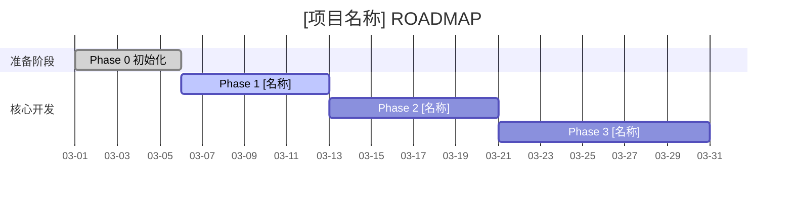

# ROADMAP

```yaml
---
Project: "[项目名称]"
Current_Phase: "Phase 0 - 初始化与规划"
Phase_Status: PLANNING          # PLANNING|SPEC_READY|RED_TESTS|GREEN_CODE|GATE_CHECK|REVIEW|DONE
Active_Mode: 1                  # 0=Vibe | 1=Standard(default) | 2=Production
Pending_Debt: false
Debt_Deadline: null             # ISO8601，仅 Vibe Sprint 后设置，例: 2026-03-08T21:00:00+08:00
Phases_Since_Vibe: 0            # 距上次 Vibe Sprint 的阶段计数（满3可解锁下一次）
Core_Tech_Stack: "[语言 / 框架]"
---
```

---

## 项目总体目标

> 一句话描述核心价值

**成功定义**（可验证标准）：
- [ ] [目标 1 — 可量化]
- [ ] [目标 2 — 可量化]
- [ ] [目标 3 — 可量化]

**总体进度**：5%

---

## 阶段进度仪表盘

| 阶段 | 名称 | 目标 | 状态 | Phase_Status | 预计耗时 | 实际耗时 | 开始 | 结束 |
|:----:|------|------|------|:------------:|----------|----------|------|------|
| 0 | 初始化与规划 | 搭建脚手架、确立规范 | 🔄 进行中 | PLANNING | 4–8h | — | [日期] | [日期] |
| 1 | [阶段1名称] | [一句话目标] | ⏳ 计划中 | — | [预估] | — | — | — |
| 2 | [阶段2名称] | [一句话目标] | ⏳ 计划中 | — | [预估] | — | — | — |
| 3 | [阶段3名称] | [一句话目标] | ⏳ 计划中 | — | [预估] | — | — | — |

**状态图例**：✅ 已完成 | 🔄 进行中 | ⏳ 计划中 | ⏸️ 已暂停 | ❌ 已取消

---

## 项目甘特图



---

## 阶段详情

### Phase 0 — 初始化与规划

**目标**：搭建 AI 辅助开发脚手架，确立项目技术规范与架构方向

**交付物清单**：
- [ ] ROADMAP.md 填写完毕
- [ ] docs/SYSTEM_CONTEXT.md 架构决策记录
- [ ] 核心技术栈选型完成（ADR 记录）
- [ ] Phase 1 的 SPEC 文档初稿

**阶段结束仪式**：
- [ ] 三门禁通过
- [ ] WALKTHROUGH_PHASE_0.md 产出
- [ ] CODE_REVIEW_PHASE_0.md 产出
- [ ] ROADMAP.md Phase_Status 更新为 DONE
