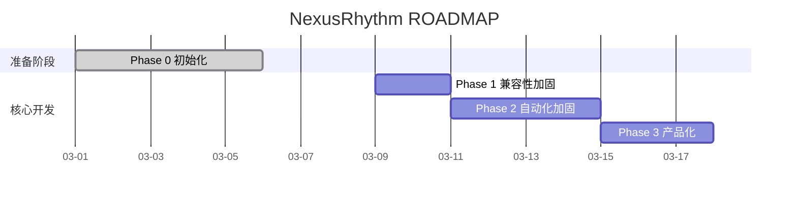

# ROADMAP

```yaml
---
Project: "NexusRhythm"
Current_Phase: "Phase 0 - 初始化与规划"
Phase_Status: DONE              # PLANNING|SPEC_READY|RED_TESTS|GREEN_CODE|GATE_CHECK|REVIEW|DONE
Active_Mode: 1                  # 0=Vibe | 1=Standard(default) | 2=Production
Pending_Debt: false
Debt_Deadline: null             # ISO8601，仅 Vibe Sprint 后设置，例: 2026-03-08T21:00:00+08:00
Phases_Since_Vibe: 1            # 距上次 Vibe Sprint 的阶段计数（满3可解锁下一次）
Core_Tech_Stack: "Markdown, Claude Code config, Bash hooks, Git"
---
```

---

## 项目总体目标

> 把 Claude Code 的最佳实践沉淀为 clone 即用、文件驱动、可持续演进的 AI 协作开发脚手架

**成功定义**（可验证标准）：
- [x] 新项目或存量项目可在 10 分钟内完成脚手架注入与会话启动
- [x] hooks、commands、subagents 已按 2026-03-08 官方 Claude Code 文档完成一次兼容性审计并修复关键问题
- [x] 形成 Phase 1 可执行 SPEC，将软性 prompt 约束升级为可验证的 scripts、CI 和 skills 体系

**总体进度**：40%

---

## 阶段进度仪表盘

| 阶段 | 名称 | 目标 | 状态 | Phase_Status | 预计耗时 | 实际耗时 | 开始 | 结束 |
|:----:|------|------|------|:------------:|----------|----------|------|------|
| 0 | 初始化与规划 | 明确定位、完成官方兼容性审计、补齐 Phase 1 规划文档 | ✅ 已完成 | DONE | 4–8h | 3.5h | 2026-03-08 | 2026-03-08 |
| 1 | Claude Code 兼容性加固 | 落地 hooks smoke tests、`/doctor` 自检与一项代表性 workflow 试点迁移 | ⏳ 计划中 | — | 1–2d | — | — | — |
| 2 | 自动化与硬门禁 | 把软性流程约束升级为可验证的脚本、CI 和更稳定的 skills 体系 | ⏳ 计划中 | — | 2–4d | — | — | — |
| 3 | 示例工程与产品化 | 提供 demo 项目、安装验证和对外发布材料 | ⏳ 计划中 | — | 2–3d | — | — | — |

**状态图例**：✅ 已完成 | 🔄 进行中 | ⏳ 计划中 | ⏸️ 已暂停 | ❌ 已取消

**规划输入规则**：
- 执行过程中产生的点子先进入 `docs/ideas/IDEA_BACKLOG.md`
- 只有经过 `/idea-review` 审核为 `Approved Now` / `Approved Later` 的点子，才允许进入本 ROADMAP

---

## 项目甘特图



---

## 阶段详情

### Phase 0 — 初始化与规划

**目标**：搭建 AI 辅助开发脚手架，确立项目技术规范与架构方向

**交付物清单**：
- [x] ROADMAP.md 填写完毕
- [x] docs/SYSTEM_CONTEXT.md 架构决策记录
- [x] 核心技术栈选型完成（ADR 记录）
- [x] Phase 1 的 SPEC 文档初稿

**阶段结束仪式**：
- [x] 三门禁通过
- [x] WALKTHROUGH_PHASE_0.md 产出
- [x] CODE_REVIEW_PHASE_0.md 产出
- [x] ROADMAP.md Phase_Status 更新为 DONE
