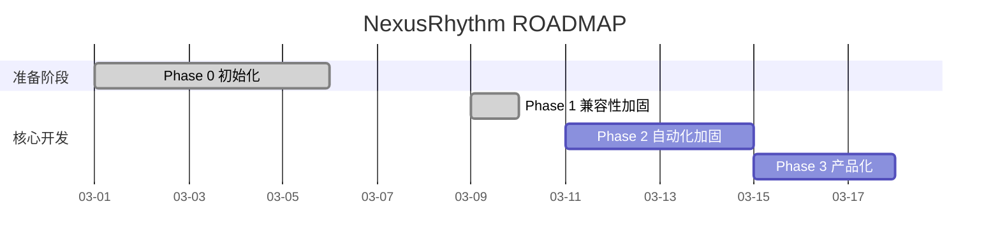

# ROADMAP

```yaml
---
Project: "NexusRhythm"
Project_Stage: "DELIVERY"       # IDEA|DISCOVERY|MVP_DEFINED|ROADMAP_READY|DELIVERY
Current_Phase: "Phase 2 - 自动化与硬门禁（Slice B：gate-check skill 边界硬化）"
Phase_Status: "SPEC_READY" # PLANNING|SPEC_READY|RED_TESTS|GREEN_CODE|GATE_CHECK|REVIEW|DONE
Active_Mode: 1                  # 0=Vibe | 1=Standard(default) | 2=Production
Pending_Debt: false
Debt_Deadline: null             # ISO8601，仅 Vibe Sprint 后设置，例: 2026-03-08T21:00:00+08:00
Phases_Since_Vibe: 2 # 距上次 Vibe Sprint 的阶段计数（满3可解锁下一次）
Idea_Clarity: 4
Target_User: "Claude Code 重度使用者、需要项目级节奏治理的个人开发者与小团队"
Core_Problem: "项目在目标明确后交付质量高，但缺少脚本化执行层和模糊 idea 的前置收敛层"
Success_Metrics: "10 分钟内完成脚手架注入；核心命令有脚本和 smoke tests；Discovery 产物可追溯到 Delivery SPEC"
Primary_Risk: "如果继续依赖 prompt 自觉执行，Discovery 与 Delivery 会同时漂移"
Core_Tech_Stack: "Markdown, Claude Code config, Bash hooks, Git"
---
```

---

## 项目总体目标

> 把 Claude Code 的最佳实践沉淀为 clone 即用、文件驱动、可持续演进的 AI 协作开发脚手架

**成功定义**（可验证标准）：
- [x] 新项目或存量项目可在 10 分钟内完成脚手架注入与会话启动
- [x] hooks、commands、subagents 已按 2026-03-08 官方 Claude Code 文档完成一次兼容性审计并修复关键问题
- [x] 形成 Phase 1 可执行 SPEC，将软性 prompt 约束升级为可验证的 scripts、CI 和 skills 体系

## Discovery 摘要

- 当前 `Project_Stage` 为 `DELIVERY`，说明项目已完成前置定义，当前重点是把 Delivery 内核工程化并补齐 Discovery 入口
- `Project_Stage` 管 idea 到 roadmap 的成熟度；`Phase_Status` 只管当前 Delivery 阶段的执行状态
- Discovery 产物链路固定为：`IDEA_BRIEF -> MVP_CANVAS -> ROADMAP_INIT -> DELIVERY`

**总体进度**：55%

---

## 阶段进度仪表盘

| 阶段 | 名称 | 目标 | 状态 | Phase_Status | 预计耗时 | 实际耗时 | 开始 | 结束 |
|:----:|------|------|------|:------------:|----------|----------|------|------|
| 0 | 初始化与规划 | 明确定位、完成官方兼容性审计、补齐 Phase 1 规划文档 | ✅ 已完成 | DONE | 4–8h | 3.5h | 2026-03-08 | 2026-03-08 |
| 1 | Claude Code 兼容性加固 | 落地 hooks smoke tests、`/doctor` 自检与一项代表性 workflow 试点迁移 | ✅ 已完成 | DONE | 1–2d | 2.5h | 2026-03-09 | 2026-03-09 |
| 2 | 自动化与硬门禁 | 把软性流程约束升级为可验证的脚本、CI 和更稳定的 skills 体系，并增强 AI 默认引导能力 | 🔄 进行中 | SPEC_READY | 2–4d | — | 2026-03-09 | — |
| 3 | 示例工程与产品化 | 提供 demo 项目、新手零感知体验验证、安装验证和对外发布材料 | ⏳ 计划中 | — | 2–3d | — | — | — |

**状态图例**：✅ 已完成 | 🔄 进行中 | ⏳ 计划中 | ⏸️ 已暂停 | ❌ 已取消

**规划输入规则**：
- 执行过程中产生的点子先进入 `docs/ideas/IDEA_BACKLOG.md`
- 只有经过 `/idea-review` 审核为 `Approved Now` / `Approved Later` 的点子，才允许进入本 ROADMAP
- 新增计划、评估、设计类文档时，文件名遵循 `docs/RHYTHM.md` 中的文档命名规则

---

## 项目甘特图



---

## 阶段详情

### Phase 0 — 初始化与规划

**目标**：搭建 AI 辅助开发脚手架，确立项目技术规范与架构方向

**交付物清单**：
- [x] ROADMAP.md 填写完毕
- [x] docs/SYSTEM_CONTEXT.md 架构决策记录
- [x] 核心技术栈选型完成（ADR 记录）
- [x] Phase 1 的 SPEC 文档初稿

**阶段结束仪式**：
- [x] 三门禁通过
- [x] WALKTHROUGH_PHASE_0.md 产出
- [x] CODE_REVIEW_PHASE_0.md 产出
- [x] ROADMAP.md Phase_Status 更新为 DONE

### Phase 1 — Claude Code 兼容性加固

**目标**：落地 hooks smoke tests、`/doctor` 自检与一项代表性 workflow 试点迁移

**交付物清单**：
- [x] `/sync` 导航卡输出与渐进式披露
- [x] hooks / `/sync` / `/review` / 合规审计相关 smoke tests
- [x] `doctor` workflow 试点迁移到 `.claude/skills/doctor/SKILL.md`
- [x] `install.sh` 支持复制 `.claude/skills/`
- [x] `WALKTHROUGH_PHASE_1.md` 产出
- [x] `CODE_REVIEW_PHASE_1.md` 产出

**阶段结束仪式**：
- [x] 三门禁通过
- [x] WALKTHROUGH_PHASE_1.md 产出
- [x] CODE_REVIEW_PHASE_1.md 产出
- [x] ROADMAP.md Phase_Status 更新为 DONE

### Phase 2 — 自动化与硬门禁

**目标**：分两刀推进自动化硬化；先打通 CI 基线，再收紧关键 workflow 的 command/skill 边界

**Slice A：CI-backed hard gates（已完成中期收口）**
- [x] 仓库内置 CI workflow，显式运行 `doctor`、smoke tests 和 `gate-check`
- [x] `install.sh` 支持把 CI workflow 一起注入目标项目
- [x] `/doctor` 能识别关键自动化接线是否缺失
- [x] 形成中期收口材料：`docs/specs/SPEC_PHASE_2_ci-backed-hard-gates.md`、`docs/walkthroughs/WALKTHROUGH_PHASE_2.md`、`docs/reviews/CODE_REVIEW_PHASE_2.md`

**Slice B：gate-check skill 边界硬化（当前活跃）**
- [ ] 新增 `.claude/skills/gate-check/SKILL.md`，提供稳定的 skill 入口
- [ ] 保持 `/gate-check` command 兼容入口，不破坏已有使用路径
- [ ] 为 gate-check skill 增加 smoke tests，锁定安装传播和关键能力点
- [ ] 明确 command-first / skill-first 的边界，避免后续继续无序平移命令

**阶段约束**：
- [x] Slice A 不在前半段同时推进大规模 skill 迁移
- [x] CI 逻辑不复制第二套脚本；统一复用现有 `scripts/nr.py` 入口
- [ ] Slice B 继续只迁移一个已有脚本入口的 workflow，不扩成全量 skills 改造
- [ ] 不把 skill 变成 command 文案的机械复制；优先强化“何时用、如何解释结果”的边界
