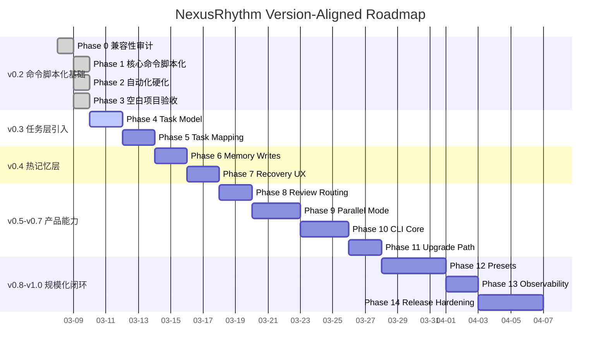

# ROADMAP

```yaml
---
Project: "NexusRhythm"
Project_Stage: "DELIVERY"       # IDEA|DISCOVERY|MVP_DEFINED|ROADMAP_READY|DELIVERY
Current_Phase: "Phase 4 - v0.3 任务层引入（Task model and storage contract）"
Phase_Status: "PLANNING" # PLANNING|SPEC_READY|RED_TESTS|GREEN_CODE|GATE_CHECK|REVIEW|DONE
Active_Mode: 1                  # 0=Vibe | 1=Standard(default) | 2=Production
Pending_Debt: false
Debt_Deadline: null             # ISO8601，仅 Vibe Sprint 后设置，例: 2026-03-08T21:00:00+08:00
Phases_Since_Vibe: 3 # 距上次 Vibe Sprint 的阶段计数（满3可解锁下一次）
Idea_Clarity: 4
Target_User: "Claude Code 重度使用者、需要项目级节奏治理的个人开发者与小团队"
Core_Problem: "项目在目标明确后交付质量高，但缺少脚本化执行层和模糊 idea 的前置收敛层"
Success_Metrics: "10 分钟内完成脚手架注入；核心命令有脚本和 smoke tests；Discovery 产物可追溯到 Delivery SPEC"
Primary_Risk: "如果先继续堆外层产品化，而不先补任务层与热记忆层，后续 CLI / preset / 并行能力会建立在不稳定中层之上"
Core_Tech_Stack: "Markdown, Claude Code config, Bash hooks, Git"
---
```

---

## 项目总体目标

> 把 Claude Code 的最佳实践沉淀为 clone 即用、文件驱动、可持续演进的 AI 协作开发脚手架

**成功定义**（可验证标准）：
- [x] 新项目或存量项目可在 10 分钟内完成脚手架注入与会话启动
- [x] hooks、commands、subagents 已按 2026-03-08 官方 Claude Code 文档完成一次兼容性审计并修复关键问题
- [x] 形成可验证的 scripts、CI、skills 基线，并用空白项目 bootstrap 验证安装后链路
- [ ] 补齐任务层与热记忆层，让跨会话和阶段内多任务协作稳定可执行
- [ ] 在 CLI、preset、迁移和可观测性层形成可升级的产品闭环

## Discovery 摘要

- 当前 `Project_Stage` 为 `DELIVERY`，说明项目已完成前置定义，当前重点是把产品路线拆成可执行的全局 Phase
- `docs/PRODUCT_ROADMAP_v0.2_to_v1.0.md` 是战略版本路线；本 `ROADMAP.md` 是该路线的执行分解与状态真相源
- 未来新增阶段必须先挂到正确版本桶下，再进入实现，不允许脱离版本路线单独扩张

**总体进度**：27%（按 15 个全局 Phase 计，已完成 4 个）

---

## 版本总览

| 版本 | 主题 | 映射 Phases | 状态 |
|------|------|-------------|------|
| v0.2 | 命令脚本化基础 | Phase 0-3 | ✅ 已完成 |
| v0.3 | 任务层引入 | Phase 4-5 | 🔄 下一主线 |
| v0.4 | 热记忆层 | Phase 6-7 | ⏳ 计划中 |
| v0.5 | 评审路由升级 | Phase 8 | ⏳ 计划中 |
| v0.6 | 可选并行模式 | Phase 9 | ⏳ 计划中 |
| v0.7 | CLI 初版 | Phase 10-11 | ⏳ 计划中 |
| v0.8 | Preset 与模板生态 | Phase 12 | ⏳ 计划中 |
| v0.9 | 稳定性与可观测性 | Phase 13 | ⏳ 计划中 |
| v1.0 | 节奏操作系统完成态 | Phase 14 | ⏳ 计划中 |

**防漂移规则**：
- `docs/PRODUCT_ROADMAP_v0.2_to_v1.0.md` 负责定义版本级战略顺序
- `ROADMAP.md` 负责把该顺序分解为可执行的全局 Phase
- 任何新 Phase 必须先归属到正确版本，再开始写 SPEC 或实现

---

## 全局 Phase Ledger

| Phase | 归属版本 | 目标 | 状态 | Phase_Status | 预计耗时 | 实际耗时 | 开始 | 结束 |
|:----:|----------|------|------|:------------:|----------|----------|------|------|
| 0 | v0.2 | Scaffold bootstrap 与官方兼容性审计 | ✅ 已完成 | DONE | 4–8h | 3.5h | 2026-03-08 | 2026-03-08 |
| 1 | v0.2 | 核心命令脚本化与 workflow enforcement baseline | ✅ 已完成 | DONE | 1–2d | 2.5h | 2026-03-09 | 2026-03-09 |
| 2 | v0.2 | 自动化硬化、CI、smoke tests、skill 边界基线 | ✅ 已完成 | DONE | 2–4d | 2.5h | 2026-03-09 | 2026-03-09 |
| 3 | v0.2 | 空白项目 bootstrap 验证与安装后链路验收 | ✅ 已完成 | DONE | 0.5–1d | 1.5h | 2026-03-09 | 2026-03-09 |
| 4 | v0.3 | Task model and storage contract（`.nexus/tasks`、`task.yaml`、生命周期面） | 🔄 当前阶段 | PLANNING | 1–2d | — | — | — |
| 5 | v0.3 | Phase-task mapping、task handoff、task-aware review context | ⏳ 计划中 | — | 1–2d | — | — | — |
| 6 | v0.4 | 热记忆写入路径（`today`、`active-tasks`、`blockers`、`handoff`）与 session flush 设计 | ⏳ 计划中 | — | 1–2d | — | — | — |
| 7 | v0.4 | `/sync` 与 `/doctor` 一致消费热记忆并支持恢复 UX | ⏳ 计划中 | — | 1–2d | — | — | — |
| 8 | v0.5 | 评审触发矩阵与 `security-reviewer` / `performance-reviewer` 路由 | ⏳ 计划中 | — | 1–2d | — | — | — |
| 9 | v0.6 | Worktree config、并行启动/清理流、隔离规则 | ⏳ 计划中 | — | 2–3d | — | — | — |
| 10 | v0.7 | 可安装 `nexus` CLI 包装现有脚本入口 | ⏳ 计划中 | — | 2–4d | — | — | — |
| 11 | v0.7 | 安全升级、迁移提示与兼容路径 | ⏳ 计划中 | — | 1–2d | — | — | — |
| 12 | v0.8 | Stack preset、gate mapping、模板变体 | ⏳ 计划中 | — | 2–4d | — | — | — |
| 13 | v0.9 | 上下文预算、执行日志、迁移/兼容文档 | ⏳ 计划中 | — | 1–2d | — | — | — |
| 14 | v1.0 | 发布 hardening 与端到端验收闭环 | ⏳ 计划中 | — | 2–4d | — | — | — |

**状态图例**：✅ 已完成 | 🔄 进行中 | ⏳ 计划中 | ⏸️ 已暂停 | ❌ 已取消

---

## 项目甘特图



---

## 版本拆解

### v0.2 — 命令脚本化基础

**目标**：把关键开发流程从提示词约束升级成可执行、可回归、可安装验证的动作链

**已完成 Phase**：
- [x] Phase 0：Scaffold bootstrap 与官方兼容性审计
- [x] Phase 1：核心命令脚本化与 workflow enforcement baseline
- [x] Phase 2：自动化硬化、CI、smoke tests、skill 边界基线
- [x] Phase 3：空白项目 bootstrap 验证与安装后链路验收

**本版本实际产出**：
- [x] `scripts/nr.py` 提供 `sync` / `doctor` / `gate-check` / `phase-start` / `phase-end` / `distill`
- [x] hooks、commands、skills 与安装链路完成一次兼容性加固
- [x] GitHub Actions、smoke tests 与 `doctor` 自检形成基线
- [x] `scripts/create_demo_workspace.py` 可生成最小示例工程并跑通 `doctor` / `gate-check`

### v0.3 — 任务层引入

**目标**：在不破坏 `Phase` 主轴的前提下，把阶段内任务颗粒度做实

**Phase 4：Task model and storage contract（当前活跃）**
- [ ] 明确 `.nexus/tasks/` 的目录结构与 `task.yaml` 字段
- [ ] 定义任务生命周期与最小 CLI/脚本入口
- [ ] 保持 `Phase` 仍是项目节奏主轴，task 只是阶段内执行单元

**Phase 5：Phase-task mapping / handoff / review context**
- [ ] 定义 task 与 phase 的映射关系
- [ ] 让 handoff 与 review 能读取 task 级上下文
- [ ] 补齐 task-aware 的最小回归测试

### v0.4 — 热记忆层

**目标**：把 `.nexus/memory/` 从骨架升级为真实可恢复的短期工作记忆

**Phase 6：热记忆写入路径**
- [ ] 设计 `today.md`、`active-tasks.json`、`blockers.md`、`handoff.md` 的写入时机
- [ ] 定义 session-end flush 或等价刷新机制

**Phase 7：恢复 UX**
- [ ] 让 `/sync` 与 `/doctor` 一致消费热记忆摘要
- [ ] 验证中断后 2 分钟内恢复上下文的可行性

### v0.5 — 评审路由升级

**目标**：从单 reviewer 走向 maker-checker 体系

**Phase 8**
- [ ] 定义评审触发矩阵
- [ ] 增加 `security-reviewer` 与 `performance-reviewer`
- [ ] 让 `/distill` 能直接消费更细分类的评审教训

### v0.6 — 可选并行模式

**目标**：为复杂阶段提供可选 worktree 并行能力，而非默认并行

**Phase 9**
- [ ] 定义 worktree 配置文件与启动/清理流
- [ ] 明确启用条件与隔离规则
- [ ] 保证主工作树状态保持干净

### v0.7 — CLI 初版

**目标**：让 NexusRhythm 从模板升级为可安装工具

**Phase 10**
- [ ] 交付 installable `nexus` CLI，包装现有脚本入口
- [ ] 覆盖 `init` / `update` / `doctor` / `sync` / `check` 等核心命令面

**Phase 11**
- [ ] 设计升级与迁移提示
- [ ] 保证升级不覆盖用户手写内容

### v0.8 — Preset 与模板生态

**目标**：降低不同技术栈接入门槛

**Phase 12**
- [ ] 交付 stack preset、默认 gate-check 映射与模板变体
- [ ] 优先覆盖主流 Node / Python / Next.js / Go 场景

### v0.9 — 稳定性与可观测性

**目标**：让系统更可靠、更可解释、可调试

**Phase 13**
- [ ] 补 `docs/context-budget.md`
- [ ] 补命令执行日志、配置兼容性检查与版本迁移文档

### v1.0 — 节奏操作系统完成态

**目标**：形成稳定、可复用、具备明显差异化的产品闭环

**Phase 14**
- [ ] 做端到端发布 hardening
- [ ] 验证任务层、记忆层、门禁、评审、迁移机制协同稳定

---

## 近期执行顺序

### P0：必须先完成
- [ ] Phase 4 — 任务模型与存储契约
- [ ] Phase 5 — Phase/task 映射与 task-aware handoff/review
- [ ] Phase 6 — 热记忆写入路径与 flush 设计
- [ ] Phase 7 — `/sync` / `/doctor` 热记忆恢复 UX

### P1：形成明显产品优势
- [ ] Phase 8 — 评审路由升级
- [ ] Phase 9 — 可选并行模式
- [ ] Phase 10-11 — CLI 初版与升级兼容路径

### P2：规模化推广能力
- [ ] Phase 12 — preset 与模板生态
- [ ] Phase 13 — 稳定性与可观测性
- [ ] Phase 14 — v1.0 发布收敛

---

## 规划输入规则

- 执行过程中产生的点子先进入 `docs/ideas/IDEA_BACKLOG.md`
- 只有经过 `/idea-review` 审核为 `Approved Now` / `Approved Later` 的点子，才允许进入本 ROADMAP
- 新增计划、评估、设计类文档时，文件名遵循 `docs/RHYTHM.md` 中的文档命名规则
