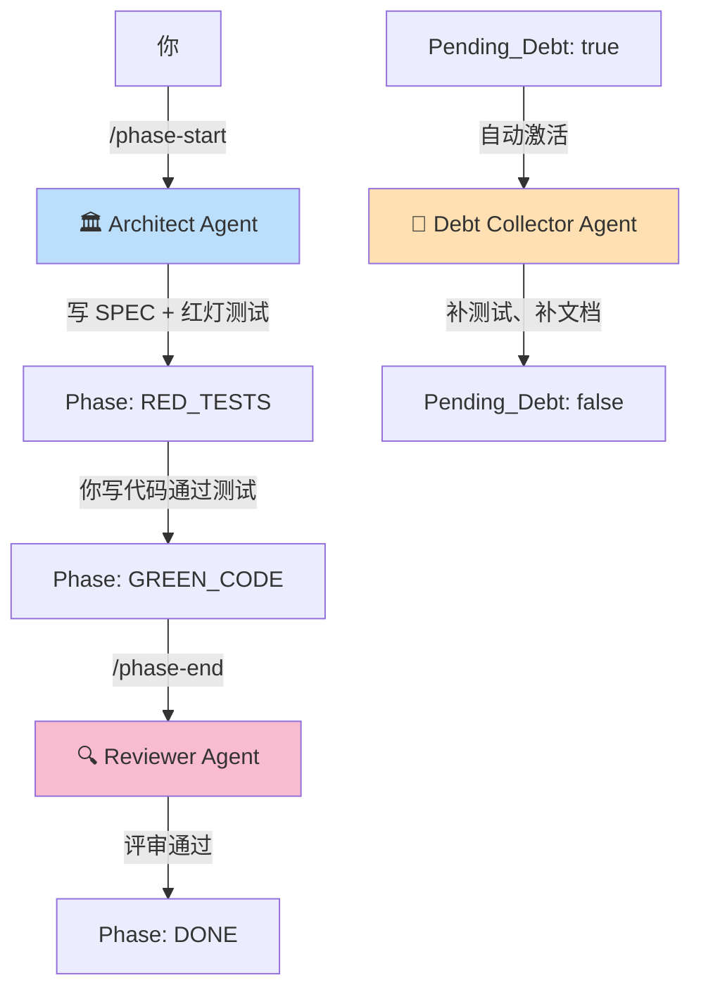
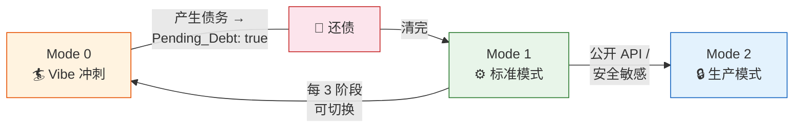

# NexusRhythm 项目说明书

<div align="center">

**AI 时代的工程开发节奏框架**

*让 Claude Code 成为真正懂你项目的搭档，而不只是一个补全代码的工具*

`v1.0` · 2026

</div>

---

## 这是什么？

**NexusRhythm** 是一套专为 **Claude Code CLI** 深度集成而设计的 AI 辅助开发框架。它不是一个库、不需要安装，而是一组**精心设计的文件和约定**——你只需要 clone 到项目里，Claude Code 就会自动理解并遵守你的开发节奏。

> 🎯 **一句话定义**：Clone 即用的 AI 开发范式脚手架，用文件结构驱动 AI 行为。

现在推荐按两段使用：

1. `Discovery`：`/idea-capture -> /mvp-shape -> /roadmap-init`
2. `Delivery`：`/phase-start -> /spec -> RED_TESTS -> GREEN_CODE -> /gate-check -> /phase-end`

---

## 快速理解工作流

如果你是第一次接触 NexusRhythm，可以把整个系统理解成两段：

1. `Discovery`：先把项目想清楚
2. `Delivery`：再把每个阶段做扎实

### 一张图看懂全流程

```mermaid
flowchart TD
    A["入口：开始新会话 / 新项目接入"]
    B["读取 ROADMAP.md YAML 头部"]
    C["输出当前状态：Phase / Phase_Status / Active_Mode / Pending_Debt"]
    D{"Pending_Debt = true ?"}
    D1["进入清债模式<br/>禁止新功能，优先还债"]

    E{"Project_Stage 是什么？"}

    E1["IDEA<br/>想法模糊，尚未成型"]
    F["执行 /idea-capture"]
    F1["生成 IDEA_BRIEF"]
    F2["Project_Stage -> DISCOVERY"]

    E2["DISCOVERY<br/>正在定义问题和用户"]
    G["执行 /mvp-shape"]
    G1["生成 MVP_CANVAS"]
    G2["Project_Stage -> MVP_DEFINED"]

    E3["MVP_DEFINED<br/>MVP 范围已收敛"]
    H["执行 /roadmap-init"]
    H1["生成 ROADMAP_INIT"]
    H2["Project_Stage -> ROADMAP_READY"]

    E4["ROADMAP_READY<br/>已有路线草案，待人工确认"]
    I["人工补齐 ROADMAP / SYSTEM_CONTEXT"]
    I1["手动切换 Project_Stage -> DELIVERY"]

    E5["DELIVERY<br/>进入正式交付开发"]

    J["可选执行 /doctor"]
    J1{"doctor 结果"}
    J2["RED<br/>脚手架或接线损坏，先修复"]
    J3["YELLOW<br/>存在非阻塞缺口，可继续但建议补齐"]
    J4["GREEN<br/>结构健康，可以继续"]

    K["执行 /phase-start [阶段名]"]
    K1{"是否满足开阶段条件？"}
    K2["拒绝开阶段<br/>原因：有债 / 不在 DELIVERY / 清晰度不够 / 上阶段未完成"]
    K3["Phase_Status -> PLANNING"]

    L["执行 /spec"]
    L1["产出本阶段 SPEC"]
    L2["Phase_Status -> SPEC_READY"]

    M["编写红灯测试"]
    M1["测试应先失败"]
    M2["Phase_Status -> RED_TESTS"]

    N["编写实现代码"]
    N1["直到测试变绿"]
    N2["Phase_Status -> GREEN_CODE"]

    O["执行 /gate-check"]
    O1{"Active_Mode 是什么？"}
    O2["Mode 0<br/>Vibe 冲刺，允许快速推进"]
    O3["Mode 1<br/>标准门禁"]
    O4["Mode 2<br/>生产门禁"]

    P{"gate-check 是否通过？"}
    P1["不通过<br/>修复后重新检查"]
    P2["通过<br/>Phase_Status -> GATE_CHECK"]

    Q["准备阶段收尾"]
    R["执行 /phase-end"]
    R1{"是否满足结束阶段条件？"}
    R2["拒绝结束阶段<br/>原因：门禁未过 / 缺 Walkthrough / 缺 Code Review"]
    R3["阶段完成<br/>Phase_Status -> DONE"]

    S["执行 /retro"]
    T["执行 /idea-review"]
    U["执行 /distill"]
    V{"是否开启下一阶段？"}
    V1["回到 /phase-start"]
    V2["结束本次会话，等待下次 /sync"]

    W["保护规则<br/>若已在 DELIVERY，禁止直接重跑 /idea-capture /mvp-shape /roadmap-init"]

    A --> B --> C --> D
    D -->|是| D1
    D -->|否| E

    E --> E1 --> F --> F1 --> F2 --> E2
    E --> E2 --> G --> G1 --> G2 --> E3
    E --> E3 --> H --> H1 --> H2 --> E4
    E --> E4 --> I --> I1 --> E5
    E --> E5 --> J

    J --> J1
    J1 -->|RED| J2
    J1 -->|YELLOW| J3
    J1 -->|GREEN| J4

    J2 --> J
    J3 --> K
    J4 --> K
    E5 --> K

    K --> K1
    K1 -->|否| K2
    K1 -->|是| K3 --> L --> L1 --> L2 --> M --> M1 --> M2 --> N --> N1 --> N2 --> O

    O --> O1
    O1 --> O2 --> P
    O1 --> O3 --> P
    O1 --> O4 --> P

    P -->|否| P1 --> O
    P -->|是| P2 --> Q --> R --> R1
    R1 -->|否| R2 --> Q
    R1 -->|是| R3 --> S --> T --> U --> V
    V -->|是| V1
    V -->|否| V2

    D1 --> V2
    W --> E5
```



### 图里的核心概念分别是什么意思

#### 1. 项目级状态：`Project_Stage`

它描述的是“这个项目想清楚了没有”，不是“代码写到哪一步了”。

| 状态 | 含义 | 典型动作 |
|------|------|----------|
| `IDEA` | 只有一个模糊想法，还没有结构化问题定义 | `/idea-capture` |
| `DISCOVERY` | 正在定义问题、用户和价值，但 MVP 还没收敛 | `/mvp-shape` |
| `MVP_DEFINED` | MVP 边界已经明确，知道先做什么、不做什么 | `/roadmap-init` |
| `ROADMAP_READY` | 有了初步路线草案，但还没进入正式交付 | 补齐 `ROADMAP.md` / `SYSTEM_CONTEXT.md` |
| `DELIVERY` | 项目定义已经清晰，可以正式进入阶段开发 | `/phase-start` |

#### 2. 交付级状态：`Phase_Status`

它描述的是“当前这个开发阶段做到了哪一步”。

| 状态 | 含义 | 下一步 |
|------|------|--------|
| `PLANNING` | 阶段刚启动，准备写本阶段契约 | `/spec` |
| `SPEC_READY` | SPEC 已明确接口、边界和验证方式 | 写红灯测试 |
| `RED_TESTS` | 测试已写好，并且应该先失败 | 写实现代码 |
| `GREEN_CODE` | 实现已经完成，测试转绿 | `/gate-check` |
| `GATE_CHECK` | 三门禁已通过 | `/phase-end` |
| `REVIEW` | 进入评审结论处理阶段 | 补 review 结论并归档 |
| `DONE` | 当前阶段已完整结束 | 可启动下一阶段 |

#### 3. 工作模式：`Active_Mode`

| 模式 | 名称 | 意义 |
|------|------|------|
| `0` | Vibe 冲刺 | 快速实验、快速原型，允许放飞，但如果留下债务必须标记 |
| `1` | 标准模式 | 默认开发主路径，要求 `SPEC -> 红灯测试 -> 绿灯实现 -> 三门禁` |
| `2` | 生产模式 | 比模式 1 更严，要求更强的 lint、coverage 或宿主项目提供生产级校验能力 |

#### 4. 技术债开关：`Pending_Debt`

这个字段表示项目里是否存在“已经确认但还没清理”的技术债。

- 如果是 `true`：优先清债，不允许继续开新功能
- 如果是 `false`：允许继续正常推进阶段

### 每个关键节点什么时候触发

| 节点 | 触发时机 | 作用 |
|------|----------|------|
| `/sync` | 每次新会话开始时 | 先读取项目状态，不盲目开工 |
| `/idea-capture` | 只有一个模糊想法时 | 生成 `IDEA_BRIEF`，把想法变成问题定义 |
| `/mvp-shape` | 已有 `IDEA_BRIEF`，需要压缩 MVP 时 | 生成 `MVP_CANVAS`，明确 In Scope / Out Of Scope |
| `/roadmap-init` | 已有 `IDEA_BRIEF` 和 `MVP_CANVAS` 时 | 生成初始路线图，准备进入 Delivery |
| `/doctor` | 安装后、修复后、发版前 | 检查脚手架、命令、模板、hooks 是否健康 |
| `/phase-start` | 准备开启一个新的交付阶段时 | 校验前置条件并切到 `PLANNING` |
| `/spec` | 进入 `PLANNING` 后 | 给当前阶段写实现契约 |
| `RED_TESTS` | SPEC 完成后 | 先写会失败的测试，证明需求被表达出来 |
| `GREEN_CODE` | 红灯测试写完后 | 写实现，把测试修到全绿 |
| `/gate-check` | 准备提交或阶段收口前 | 执行三门禁检查 |
| `/phase-end` | 门禁通过且准备结束阶段时 | 完成阶段收尾、更新状态 |
| `/retro` | 阶段结束后 | 做简短复盘 |
| `/idea-review` | 阶段结束后 | 审核执行中冒出的新点子 |
| `/distill` | 阶段收尾后 | 把经验和坑蒸馏进规则 |

### 每个阶段的核心产物是什么

| 阶段 | 产物 | 作用 |
|------|------|------|
| `IDEA` | `IDEA_BRIEF` | 定义问题、目标用户、核心痛点 |
| `DISCOVERY` | `MVP_CANVAS` | 明确最小可验证范围和成功指标 |
| `MVP_DEFINED` | `ROADMAP_INIT` | 形成前三阶段路线草案 |
| `PLANNING` | `SPEC` | 当前阶段的实现契约 |
| `GATE_CHECK / DONE` | `WALKTHROUGH` + `CODE_REVIEW` | 阶段复盘和评审归档 |
| 日常 | `JOURNAL` / `ADR` / `.nexus/memory` | 记录工作、决策和会话接力信息 |

### 如果某一步失败，应该回哪里

| 失败点 | 常见原因 | 应该回退到哪里 |
|--------|----------|----------------|
| `/phase-start` 被拒绝 | 不在 `DELIVERY`、有债务、清晰度不够、上阶段未完成 | 回到 `Discovery` 或先补阶段收尾 |
| `/gate-check` 失败 | 类型检查、构建或测试没过 | 修代码后重新 `/gate-check` |
| `/phase-end` 失败 | 缺 `WALKTHROUGH` 或 `CODE_REVIEW`，或门禁未过 | 先补阶段产物，再重新 `/phase-end` |
| `/idea-capture`、`/mvp-shape`、`/roadmap-init` 被拒绝 | 当前项目已经在 `DELIVERY` | 不要回退状态机，改去补 backlog 或手动调整规划 |

### 一句话记住这套系统

- `Discovery` 负责把项目想清楚
- `Delivery` 负责把每个阶段做扎实
- `ROADMAP.md` 是状态真相源
- `scripts/nr.py` 是执行层
- `/doctor` 保护脚手架
- `/gate-check` 保护交付质量
- `/retro + /idea-review + /distill` 负责经验闭环

---

## 解决什么问题？

如果你使用 AI 编程工具（尤其是 Claude Code），你一定遇到过这些痛点：

| 😤 痛点 | 💡 NexusRhythm 怎么解决 |
|---------|------------------------|
| **AI 每次新会话都失忆** — 忘了项目在哪个阶段、之前踩过什么坑 | ROADMAP.md 状态机 + `.claude/rules/` 自动加载历史教训 |
| **AI 盲目写代码** — 不理解上下文就开始 coding，产出低质量代码 | 强制 SDD 先行 → 红灯测试 → 再写实现 |
| **缺乏质量保障** — 没有门禁，代码直接提交，后期还债成本巨大 | 三门禁（类型检查 + 构建 + 全量测试）挂钩到 git commit |
| **重复踩坑** — 同样的错误在不同阶段反复出现 | `/distill` 蒸馏 → `.claude/rules/lessons.md` 自动加载闭环 |
| **进度失控** — 不知道项目走到了哪一步 | ROADMAP 阶段状态机：`PLANNING → … → DONE` |
| **开发者疲劳** — 全程高纪律让人窒息 | Vibe Sprint 安全阀 — 每 3 阶段解锁一次自由编码 |

---

## 核心功能一览

### 🧠 记忆管理系统

NexusRhythm 最独特的特性 — **AI 会越来越懂你的项目**。

```
做事 → 记录(Journal/踩坑) → 蒸馏(/distill) → .claude/rules/ → AI 自动加载
                                                                    ↓
                                                              下次会话主动避坑
```

三层记忆架构：

| 层 | 类型 | 频率 | 机制 |
|:--:|------|------|------|
| **L0** | 项目日志 `/journal` | 每天 | 快速记录今天干了啥、踩了什么坑 |
| **L1** | 决策记录 `/decision` | 重要决策时 | 为什么选 A 不选 B？结构化 ADR |
| **L2** | 活知识 `.claude/rules/` | 每 3 阶段蒸馏 | 自动加载到每次 AI 会话 ⭐ |

### 📊 ROADMAP 状态机

所有进度通过 `ROADMAP.md` 的 YAML 头部管理，AI 每次会话自动读取状态：

```yaml
Current_Phase: "Phase 1 - 核心鉴权模块"
Phase_Status: GREEN_CODE
Active_Mode: 1
Pending_Debt: false
```

阶段流转严禁跳步：


### 🤖 多智能体协作

三个专业 Agent，各司其职：



| Agent | 职责 | 触发方式 |
|-------|------|----------|
| **🏛️ Architect** | 写 SPEC 文档 + 红灯测试用例 | `/phase-start`、`/spec` |
| **🔍 Reviewer** | 代码评审 + 产出 CODE_REVIEW | `/phase-end` |
| **🧹 Debt Collector** | 清理技术债务 | `Pending_Debt: true` 时自动 |

### 🚦 三门禁保障

任何代码提交前必须通过三道检查（通过 `/gate-check` 或 `/phase-end` 触发）：

```
❶ 类型检查 / 静态分析 ─── 零错误
❷ 项目构建 ────────── 成功（exit code 0）
❸ 全量测试 ────────── 100% 通过，零跳过
```

并且通过 Hooks 绑定到 `git commit`：如果 `Pending_Debt: true`，直接**阻止提交**。

### 🏄 Vibe Sprint（放飞机制）

连续高强度开发太累？每完成 3 个阶段后，你可以解锁一次 **Vibe Sprint**：
- ⏱️ 连续 4-12 小时纯编码，不写文档不跑测试
- 📝 结束后 48 小时内必须还债（补文档 + 测试）
- 🚫 超时不还？`Pending_Debt: true`，AI 拒绝一切新功能

---

## 📋 命令速查卡

### 日常命令

| 命令 | 用途 | 快速示例 |
|------|------|---------|
| `/sync` | 查看项目当前状态 | 每次开始工作时先 `/sync` |
| `/idea-capture` | 收敛模糊想法 | 只有一个想法时先 `/idea-capture ...` |
| `/mvp-shape` | 压缩成 MVP | `IDEA_BRIEF` 写完后运行 `/mvp-shape` |
| `/roadmap-init` | 初始化前三阶段路线 | `MVP_CANVAS` 完成后运行 `/roadmap-init` |
| `/journal` | 记录今日工作 | 下班前 `/journal` 花 2 分钟 |
| `/decision 选择Redis做缓存` | 记录重要技术决策 | 技术选型后立即记录 |

### 阶段管理

| 命令 | 用途 | 触发时机 |
|------|------|---------|
| `/phase-start 鉴权模块` | 启动新阶段 | 上一阶段 DONE 后 |
| `/spec JWT中间件` | 生成 SDD 文档 | 需要设计新功能时 |
| `/gate-check` | 运行三门禁 | 准备提交代码前 |
| `/phase-end` | 阶段结束仪式 | 功能完工、测试全绿后 |
| `/retro` | 2 分钟小复盘 | 阶段结束后 |

### 知识管理

| 命令 | 用途 | 推荐频率 |
|------|------|---------|
| `/distill` | 蒸馏教训到 Rules | 每 3 个阶段一次 |

---

## ⚙️ 三种工作模式



| 模式 | 适用场景 | 约束等级 |
|:----:|----------|:--------:|
| **0 — Vibe** | 周末实验、快速原型、算法探索 | ⭐ 低 |
| **1 — Standard** | 核心功能开发（**默认**） | ⭐⭐⭐ 中 |
| **2 — Production** | 公开 API、安全敏感场景 | ⭐⭐⭐⭐⭐ 高 |

---

## 🗂️ 项目结构总览

```
NexusRhythm/
│
│  ── 你每天接触的文件 ──
├── CLAUDE.md           ← Claude Code 大脑（自动加载，你不需要改）
├── ROADMAP.md          ← 项目状态看板（唯一真相源，经常更新）
│
│  ── 规范与模板 ──
├── docs/
│   ├── RHYTHM.md       ← 完整开发规范（做参考用）
│   ├── GUIDE.md        ← 📍 你正在看的这份文档
│   ├── HANDBOOK.md     ← 全流程使用手册
│   ├── SYSTEM_CONTEXT.md ← 架构约束记录
│   ├── ideas/          ← Discovery 产物与 backlog
│   ├── templates/      ← 文档模板（含 IDEA_BRIEF / MVP_CANVAS / ROADMAP_INIT / SPEC 等）
│   ├── specs/          ← 自动生成的 SDD 文档
│   ├── walkthroughs/   ← 阶段 Walkthrough 记录
│   ├── reviews/        ← Code Review 记录
│   ├── journal/        ← 每日项目日志
│   └── decisions/      ← 架构决策记录（ADR）
│
│  ── Claude Code 集成层 ──
└── .claude/
    ├── settings.json   ← Hooks 配置（SessionStart + PreToolUse）
    ├── agents/         ← architect / product-strategist / reviewer / debt-collector
    ├── rules/          ← 项目教训 + 约定（每次会话自动加载！）
    └── commands/       ← Discovery + Delivery 自定义命令

另外：

- `scripts/nr.py` 负责任务状态读写、自检、门禁和 Discovery/Delivery 脚本入口
- `.nexus/tasks/` 承载阶段内任务粒度
- `.nexus/memory/` 承载热记忆摘要
```

---

## 💎 与其他框架的区别

| 对比维度 | 普通 CLAUDE.md | AI Coding Templates | **NexusRhythm** |
|----------|---------------|-------------------|----------------|
| AI 记忆 | ❌ 每次失忆 | ❌ 每次失忆 | ✅ Rules 自动加载闭环 |
| 阶段管理 | ❌ 无 | ⚠️ 简单 checklist | ✅ YAML 状态机 + 门禁 |
| 多 Agent | ❌ 无 | ❌ 无 | ✅ 3 个专业分工 |
| 质量门禁 | ❌ 无 | ⚠️ 手动检查 | ✅ Hooks 自动拦截 |
| 放飞机制 | ❌ 全程高压 | ❌ 全程高压 | ✅ Vibe Sprint |
| 学习成本 | 低 | 低 | 中（但收益高） |

---

<div align="center">

**NexusRhythm** — 不只是帮你写代码，而是帮你 **有节奏地** 写好代码

[快速开始 →](HANDBOOK.md)

</div>
