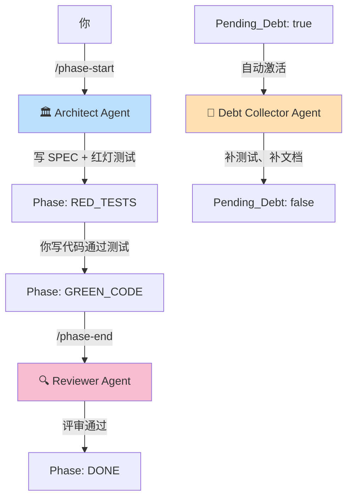
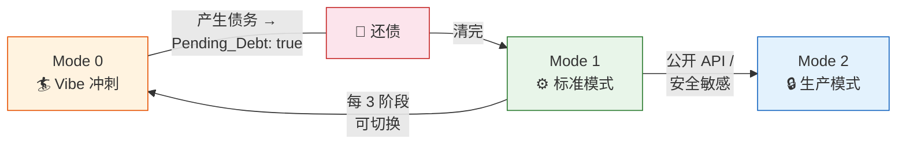

# NexusRhythm 项目说明书

<div align="center">

**AI 时代的工程开发节奏框架**

*让 Claude Code 成为真正懂你项目的搭档，而不只是一个补全代码的工具*

`v1.0` · 2026

</div>

---

## 这是什么？

**NexusRhythm** 是一套专为 **Claude Code CLI** 深度集成而设计的 AI 辅助开发框架。它不是一个库、不需要安装，而是一组**精心设计的文件和约定**——你只需要 clone 到项目里，Claude Code 就会自动理解并遵守你的开发节奏。

> 🎯 **一句话定义**：Clone 即用的 AI 开发范式脚手架，用文件结构驱动 AI 行为。

---

## 解决什么问题？

如果你使用 AI 编程工具（尤其是 Claude Code），你一定遇到过这些痛点：

| 😤 痛点 | 💡 NexusRhythm 怎么解决 |
|---------|------------------------|
| **AI 每次新会话都失忆** — 忘了项目在哪个阶段、之前踩过什么坑 | ROADMAP.md 状态机 + `.claude/rules/` 自动加载历史教训 |
| **AI 盲目写代码** — 不理解上下文就开始 coding，产出低质量代码 | 强制 SDD 先行 → 红灯测试 → 再写实现 |
| **缺乏质量保障** — 没有门禁，代码直接提交，后期还债成本巨大 | 三门禁（类型检查 + 构建 + 全量测试）挂钩到 git commit |
| **重复踩坑** — 同样的错误在不同阶段反复出现 | `/distill` 蒸馏 → `.claude/rules/lessons.md` 自动加载闭环 |
| **进度失控** — 不知道项目走到了哪一步 | ROADMAP 阶段状态机：`PLANNING → … → DONE` |
| **开发者疲劳** — 全程高纪律让人窒息 | Vibe Sprint 安全阀 — 每 3 阶段解锁一次自由编码 |

---

## 核心功能一览

### 🧠 记忆管理系统

NexusRhythm 最独特的特性 — **AI 会越来越懂你的项目**。

```
做事 → 记录(Journal/踩坑) → 蒸馏(/distill) → .claude/rules/ → AI 自动加载
                                                                    ↓
                                                              下次会话主动避坑
```

三层记忆架构：

| 层 | 类型 | 频率 | 机制 |
|:--:|------|------|------|
| **L0** | 项目日志 `/journal` | 每天 | 快速记录今天干了啥、踩了什么坑 |
| **L1** | 决策记录 `/decision` | 重要决策时 | 为什么选 A 不选 B？结构化 ADR |
| **L2** | 活知识 `.claude/rules/` | 每 3 阶段蒸馏 | 自动加载到每次 AI 会话 ⭐ |

### 📊 ROADMAP 状态机

所有进度通过 `ROADMAP.md` 的 YAML 头部管理，AI 每次会话自动读取状态：

```yaml
Current_Phase: "Phase 1 - 核心鉴权模块"
Phase_Status: GREEN_CODE
Active_Mode: 1
Pending_Debt: false
```

阶段流转严禁跳步：


### 🤖 多智能体协作

三个专业 Agent，各司其职：



| Agent | 职责 | 触发方式 |
|-------|------|----------|
| **🏛️ Architect** | 写 SPEC 文档 + 红灯测试用例 | `/phase-start`、`/spec` |
| **🔍 Reviewer** | 代码评审 + 产出 CODE_REVIEW | `/phase-end` |
| **🧹 Debt Collector** | 清理技术债务 | `Pending_Debt: true` 时自动 |

### 🚦 三门禁保障

任何代码提交前必须通过三道检查（通过 `/gate-check` 或 `/phase-end` 触发）：

```
❶ 类型检查 / 静态分析 ─── 零错误
❷ 项目构建 ────────── 成功（exit code 0）
❸ 全量测试 ────────── 100% 通过，零跳过
```

并且通过 Hooks 绑定到 `git commit`：如果 `Pending_Debt: true`，直接**阻止提交**。

### 🏄 Vibe Sprint（放飞机制）

连续高强度开发太累？每完成 3 个阶段后，你可以解锁一次 **Vibe Sprint**：
- ⏱️ 连续 4-12 小时纯编码，不写文档不跑测试
- 📝 结束后 48 小时内必须还债（补文档 + 测试）
- 🚫 超时不还？`Pending_Debt: true`，AI 拒绝一切新功能

---

## 📋 命令速查卡

### 日常命令

| 命令 | 用途 | 快速示例 |
|------|------|---------|
| `/sync` | 查看项目当前状态 | 每次开始工作时先 `/sync` |
| `/journal` | 记录今日工作 | 下班前 `/journal` 花 2 分钟 |
| `/decision 选择Redis做缓存` | 记录重要技术决策 | 技术选型后立即记录 |

### 阶段管理

| 命令 | 用途 | 触发时机 |
|------|------|---------|
| `/phase-start 鉴权模块` | 启动新阶段 | 上一阶段 DONE 后 |
| `/spec JWT中间件` | 生成 SDD 文档 | 需要设计新功能时 |
| `/gate-check` | 运行三门禁 | 准备提交代码前 |
| `/phase-end` | 阶段结束仪式 | 功能完工、测试全绿后 |
| `/retro` | 2 分钟小复盘 | 阶段结束后 |

### 知识管理

| 命令 | 用途 | 推荐频率 |
|------|------|---------|
| `/distill` | 蒸馏教训到 Rules | 每 3 个阶段一次 |

---

## ⚙️ 三种工作模式



| 模式 | 适用场景 | 约束等级 |
|:----:|----------|:--------:|
| **0 — Vibe** | 周末实验、快速原型、算法探索 | ⭐ 低 |
| **1 — Standard** | 核心功能开发（**默认**） | ⭐⭐⭐ 中 |
| **2 — Production** | 公开 API、安全敏感场景 | ⭐⭐⭐⭐⭐ 高 |

---

## 🗂️ 项目结构总览

```
NexusRhythm/
│
│  ── 你每天接触的文件 ──
├── CLAUDE.md           ← Claude Code 大脑（自动加载，你不需要改）
├── ROADMAP.md          ← 项目状态看板（唯一真相源，经常更新）
│
│  ── 规范与模板 ──
├── docs/
│   ├── RHYTHM.md       ← 完整开发规范（做参考用）
│   ├── GUIDE.md        ← 📍 你正在看的这份文档
│   ├── HANDBOOK.md     ← 全流程使用手册
│   ├── SYSTEM_CONTEXT.md ← 架构约束记录
│   ├── templates/      ← 5 个文档模板（SPEC/WALKTHROUGH/CODE_REVIEW/JOURNAL/ADR）
│   ├── specs/          ← 自动生成的 SDD 文档
│   ├── walkthroughs/   ← 阶段 Walkthrough 记录
│   ├── reviews/        ← Code Review 记录
│   ├── journal/        ← 每日项目日志
│   └── decisions/      ← 架构决策记录（ADR）
│
│  ── Claude Code 集成层 ──
└── .claude/
    ├── settings.json   ← Hooks 配置（SessionStart + PreToolUse）
    ├── agents/         ← 3 个专业 Agent
    ├── rules/          ← 项目教训 + 约定（每次会话自动加载！）
    └── commands/       ← 9 个自定义命令
```

---

## 💎 与其他框架的区别

| 对比维度 | 普通 CLAUDE.md | AI Coding Templates | **NexusRhythm** |
|----------|---------------|-------------------|----------------|
| AI 记忆 | ❌ 每次失忆 | ❌ 每次失忆 | ✅ Rules 自动加载闭环 |
| 阶段管理 | ❌ 无 | ⚠️ 简单 checklist | ✅ YAML 状态机 + 门禁 |
| 多 Agent | ❌ 无 | ❌ 无 | ✅ 3 个专业分工 |
| 质量门禁 | ❌ 无 | ⚠️ 手动检查 | ✅ Hooks 自动拦截 |
| 放飞机制 | ❌ 全程高压 | ❌ 全程高压 | ✅ Vibe Sprint |
| 学习成本 | 低 | 低 | 中（但收益高） |

---

<div align="center">

**NexusRhythm** — 不只是帮你写代码，而是帮你 **有节奏地** 写好代码

[快速开始 →](HANDBOOK.md)

</div>
