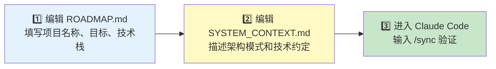
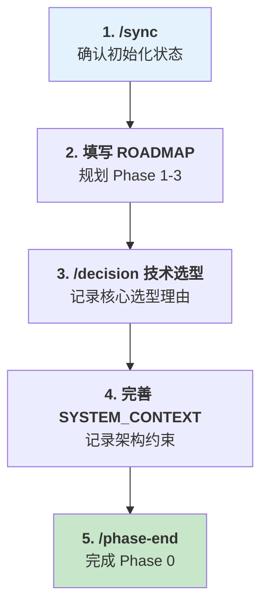
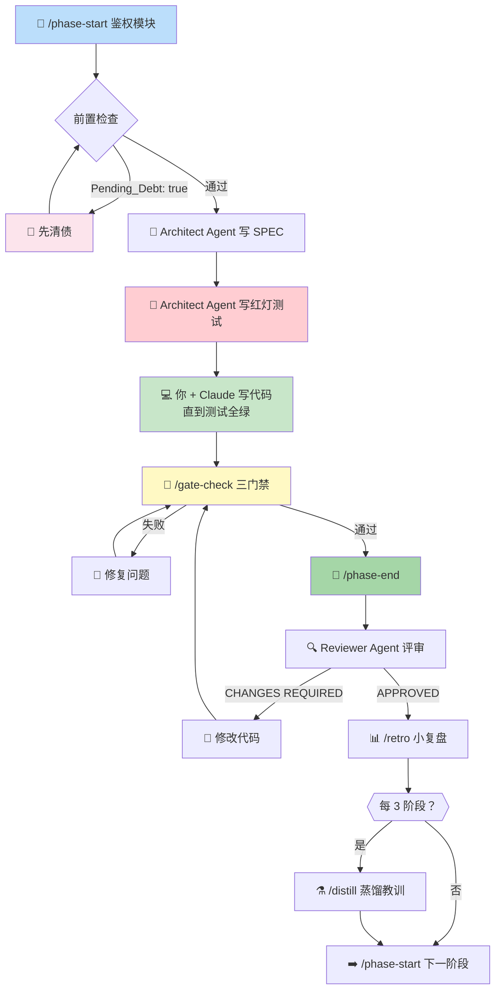
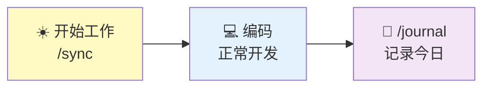
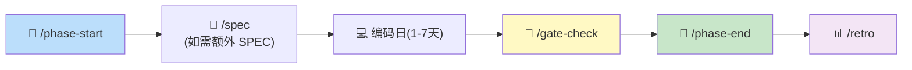
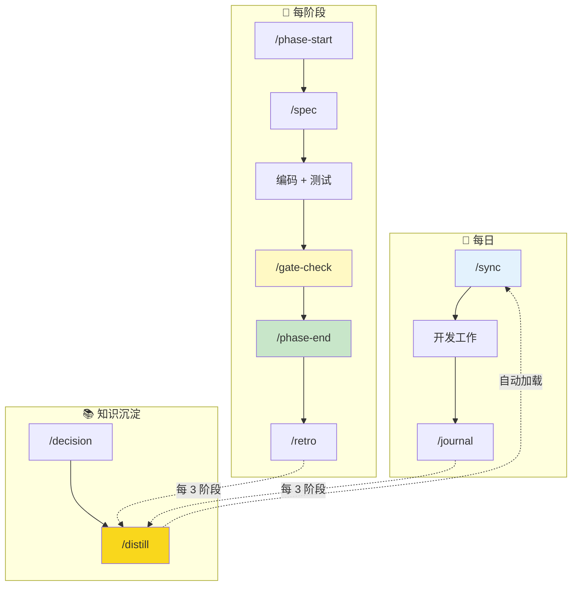

# NexusRhythm 全流程使用手册

> 📖 本手册面向实际使用者，手把手教你从零开始用 NexusRhythm + Claude Code 进行高质量开发。

---

## 目录

- [第一章：安装与初始化](#第一章安装与初始化)
- [第二章：你的第一天（Phase 0）](#第二章你的第一天phase-0)
- [第三章：完整的开发循环（Phase 1+）](#第三章完整的开发循环phase-1)
- [第四章：日常节奏](#第四章日常节奏)
- [第五章：Vibe Sprint 放飞指南](#第五章vibe-sprint-放飞指南)
- [第六章：记忆蒸馏最佳实践](#第六章记忆蒸馏最佳实践)
- [第七章：常见问题与故障排除](#第七章常见问题与故障排除)
- [附录：命令参考](#附录命令参考)

---

## 第一章：安装与初始化

### 1.1 新项目（推荐）

```bash
# 方式一：GitHub Template
# 在 GitHub 仓库页面点击 "Use this template" → "Create a new repository"

# 方式二：直接 Clone
git clone https://github.com/NeoxNexus/NexusRhythm.git my-awesome-project
cd my-awesome-project
rm -rf .git
git init
```

### 1.2 已有项目

```bash
# 在你的项目根目录执行（不覆盖已有文件）
bash install.sh /path/to/your-project
```

### 1.3 初始化三步走

拿到脚手架后，你需要做三件事：



#### Step 1：编辑 `ROADMAP.md`

打开 ROADMAP.md，找到 YAML 头部，填写你的项目信息：

```yaml
---
Project: "我的电商后端"
Current_Phase: "Phase 0 - 初始化与规划"
Phase_Status: PLANNING
Active_Mode: 1
Pending_Debt: false
Debt_Deadline: null
Phases_Since_Vibe: 0
Core_Tech_Stack: "Python, FastAPI, PostgreSQL"
---
```

然后填写下方的：
- **项目总体目标**和**成功定义**
- **阶段进度仪表盘**（至少规划前 3 个阶段）
- **甘特图**（可选但推荐）

#### Step 2：编辑 `docs/SYSTEM_CONTEXT.md`

记录你的核心架构约定，例如：

```markdown
## 2. 核心架构模式
本项目采用分层架构：routes → services → repositories → models

## 3. 核心技术约定
| 类别 | 约定 | 原因 |
|------|------|------|
| 认证 | 所有 API 使用 JWT Bearer Token | 无状态，适合微服务 |
| ORM | SQLAlchemy 2.0 + async | 项目全量 async |
| 格式化 | Black + isort | 团队统一 |
```

#### Step 3：验证

```bash
# 用 Claude Code 打开项目
claude

# 输入 /sync 验证安装
> /sync
```

你应该看到类似这样的输出（由 SessionStart Hook 或 /sync 命令触发）：

```
═══════════════════════════════
📍 Phase: Phase 0 - 初始化与规划
🔄 Status: PLANNING
⚙️  Mode: 1  |  🔧 Debt: false
═══════════════════════════════

✅ 项目状态正常，可以开始工作。
```

---

## 第二章：你的第一天（Phase 0）

Phase 0 是特殊的——它是你用 NexusRhythm 的起步阶段。

### 2.1 Phase 0 的典型流程



### 2.2 实际操作示例

```
你：/sync

Claude：
═══════════════════════════════
📍 Phase: Phase 0 - 初始化与规划
🔄 Status: PLANNING
⚙️  Mode: 1  |  🔧 Debt: false
═══════════════════════════════

你：我选择了 FastAPI + PostgreSQL + Redis 做技术栈，帮我记录一下

Claude：(引导你填写 ADR)

你：/decision 选择 FastAPI 作为 Web 框架

Claude：(生成 docs/decisions/ADR-001-选择FastAPI.md)

你：Phase 0 的工作都完成了，结束这个阶段

你：/phase-end

Claude：(执行阶段结束仪式 → 产出 Walkthrough → 更新 ROADMAP)
```

---

## 第三章：完整的开发循环（Phase 1+）

这是 NexusRhythm 的核心流程。以实际例子演示一个完整的 Phase 1 开发。

### 3.1 全流程概览



### 3.2 Step-by-Step 详解

#### Step 1：启动阶段 `/phase-start`

```
你：/phase-start 核心鉴权模块

Claude：
  ✅ 前置检查通过
  - Pending_Debt: false ✓
  - Phase 0 已完成 ✓
  
  请用一句话描述本阶段目标：
  
你：实现 JWT 鉴权中间件，保护所有 API 端点

Claude：
  📋 阶段已创建：
  - ROADMAP.md 已更新 → Phase 1, Status: PLANNING
  - 正在召唤 Architect Agent...
```

#### Step 2：Architect Agent 产出 SPEC + 红灯测试

Architect Agent 会自动：

1. 在 `docs/specs/SPEC_PHASE_1_JWT鉴权.md` 生成 SDD 文档
2. 在 `tests/test_phase_1_auth.py` 生成会失败的测试

```
Architect：
  ✅ SPEC 已创建：docs/specs/SPEC_PHASE_1_JWT鉴权.md
  ✅ 红灯测试已创建：tests/test_phase_1_auth.py (6 个测试，全部 FAIL)
  
  ROADMAP Phase_Status → RED_TESTS
  
  📋 测试清单：
  - test_auth_valid_token ❌
  - test_auth_expired_token ❌
  - test_auth_invalid_signature ❌
  - test_auth_missing_header ❌
  - test_auth_malformed_token ❌
  - test_auth_token_refresh ❌
  
  现在可以开始实现代码了！目标：让这 6 个测试全部通过。
```

#### Step 3：编写实现代码（你 + Claude）

这是你与 Claude 结对编程的主要时间。正常对话即可：

```
你：现在帮我实现 JWT 中间件，需要通过上面 6 个测试

Claude：(读取 SPEC，按照定义的接口和边界条件编码)
        (先实现核心逻辑 → 逐步让测试从红变绿)
```

> 💡 **最佳实践**：让 Claude 每实现一部分后就跑一次测试，逐步让红灯变绿灯。

#### Step 4：门禁检查 `/gate-check`

所有测试通过后：

```
你：/gate-check

Claude：
  ❶ 类型检查（mypy）：PASS ✅
  ❷ 构建检查：PASS ✅
  ❸ 全量测试（pytest）：6/6 PASS ✅
  
  ✅ GATE CHECK PASSED
  ROADMAP Phase_Status → GATE_CHECK
  
  现在可以运行 /phase-end 执行阶段结束仪式。
```

#### Step 5：阶段结束 `/phase-end`

```
你：/phase-end

Claude：
  Step 1: 三门禁确认 ✅（已在 /gate-check 通过）
  Step 2: ROADMAP 已更新 → Phase_Status: REVIEW
  Step 3: Walkthrough 已生成 → docs/walkthroughs/WALKTHROUGH_PHASE_1.md
  Step 4: 正在召唤 Reviewer Agent...
  
Reviewer：
  ✅ APPROVED
  
  📋 CODE_REVIEW_PHASE_1.md 已生成
  
  值得表扬的：JWT 中间件设计简洁，边界条件覆盖完整
  改善建议：建议为 token 刷新增加滑动窗口逻辑
  
  Step 5: 小复盘
  
  Q1: 本阶段预估多少小时？实际花了多少？
```

#### Step 6：复盘 `/retro`

```
你：/retro

Claude：
  Q1: 预估 vs 实际？
你：预估 8h，实际 12h

  Q2: 最大意外？
你：PyJWT 默认不验证 audience，坑了 2 小时

  Q3: 最大收获？
你：用 Depends 注入 middleware 比装饰器模式更优雅

  Q4: 下阶段想改进什么？
你：预估时间要乘 1.5

Claude：✅ 复盘已记录到 WALKTHROUGH_PHASE_1.md

  💡 提示：你已完成第 1 个阶段。
  还需再完成 2 个阶段才能解锁 Vibe Sprint 🏄
```

---

## 第四章：日常节奏

### 4.1 每日节奏



| 时机 | 动作 | 耗时 |
|------|------|------|
| 开始工作 | `/sync` — 确认当前状态 | 10 秒 |
| 做了重要决策 | `/decision [主题]` — 记录 ADR | 3 分钟 |
| 结束工作 | `/journal` — 记录今天做了什么、踩了什么坑 | 2 分钟 |

### 4.2 每阶段节奏



### 4.3 每 3 阶段节奏

```
Phase 1 → Phase 2 → Phase 3 → /distill → (可选 Vibe Sprint) → Phase 4 ...
```

---

## 第五章：Vibe Sprint 放飞指南

### 5.1 触发条件

```
Phases_Since_Vibe >= 3
```

### 5.2 进入 Vibe Sprint

手动修改 `ROADMAP.md`：

```yaml
Active_Mode: 0              # 从 1 切到 0
Phases_Since_Vibe: 0         # 重置计数器
```

### 5.3 Vibe Sprint 中可以做什么

| ✅ 允许 | ❌ 不允许 |
|---------|----------|
| 快速写原型代码 | 跳过还债（48小时内必须还） |
| 不写测试 | 永远留在 Mode 0 |
| 不写文档 | 忽略已有测试的失败 |
| 探索新想法 | 破坏已有的通过测试的代码 |

### 5.4 退出 Vibe Sprint

Sprint 结束后（通常 4-12 小时），手动修改 `ROADMAP.md`：

```yaml
Active_Mode: 1               # 切回标准模式
Pending_Debt: true            # 标记有债务
Debt_Deadline: "2026-03-09T21:00:00+08:00"  # 48小时后
```

然后 Claude Code 会自动进入还债模式：
- Debt Collector Agent 自动激活
- 补写测试、文档
- 完成后设 `Pending_Debt: false`

---

## 第六章：记忆蒸馏最佳实践

### 6.1 什么时候蒸馏

| 时机 | 必要性 |
|------|--------|
| 每完成 3 个阶段 | ⭐⭐⭐ 强烈推荐 |
| Vibe Sprint 还债后 | ⭐⭐⭐ 强制 |
| 踩了一个大坑后 | ⭐⭐ 推荐立即蒸馏 |
| 觉得项目日志太多了 | ⭐ 可选 |

### 6.2 蒸馏效果示例

**蒸馏前**（散落在多个 Journal 和 Walkthrough 中）：
```
2026-03-06.md: 🕳️ PyJWT decode 默认不验证 audience
WALKTHROUGH_1.md: 踩坑 — fastapi.Depends 不能模块级声明
2026-03-08.md: 🕳️ SQLAlchemy async session 不能在同步函数中用
```

**蒸馏后**（`/distill` → `.claude/rules/lessons.md`）：
```markdown
## 技术栈教训
- [PyJWT] `decode()` 必须显式设置 `algorithms=["HS256"]` + `audience`
- [FastAPI] `Depends()` 不能在模块级声明，必须作为函数参数
- [SQLAlchemy] async session 必须在 async 函数中使用，不能混用 sync
```

**下次 Claude Code 会话时**，这些教训**自动加载**，AI 会主动避免这些错误。

### 6.3 维护 conventions.md

`.claude/rules/conventions.md` 不通过 `/distill` 自动更新，需要你手动维护：

```markdown
## 命名约定
- 路由文件：`routes/v1/[resource].py`
- Service 文件：`services/[domain]_service.py`
- 测试文件：`tests/test_[module].py`

## 禁忌
- ❌ 不要 `from module import *`
- ❌ 不要在 pydantic model 用 mutable default
```

---

## 第七章：常见问题与故障排除

### Q1：Claude Code 没有自动读取 ROADMAP 状态？

**原因**：SessionStart Hook 可能未正确触发。

**解决**：手动输入 `/sync`，效果等同。

### Q2：`/phase-start` 显示 "上一阶段未完成"？

**解决**：检查 ROADMAP.md 中上一阶段的 `Phase_Status` 是否为 `DONE`。如果不是，先完成 `/phase-end`。

### Q3：`Pending_Debt: true` 导致所有操作被拦截？

**解决步骤**：
1. 运行 `/distill` 蒸馏教训
2. 让 Debt Collector Agent 补齐缺失的测试/文档
3. 确认所有债务清理后，将 `Pending_Debt` 改为 `false`

### Q4：我想跳过某个步骤（比如不想写 SPEC）？

**Mode 1+**：**不行**。这是刻意的设计约束。
- 如果你觉得写 SPEC 太重，考虑切到 **Mode 0**（但要接受还债）

**Mode 0**：随意，没有约束。但 48 小时内需要还债。

### Q5：`.claude/rules/lessons.md` 越来越大怎么办？

**最佳实践**：
- 每次 `/distill` 后检查是否有过时的教训
- 把已经内化到代码/配置中的教训删除
- 保持文件在 50 行以内，越精炼越好

### Q6：我想调整三门禁的检查命令？

编辑 `.claude/commands/gate-check.md`，修改其中的"根据技术栈选择对应命令"部分。例如对 Python 项目：

```markdown
### ❶ 类型检查
- 命令：`mypy src/ --strict`
### ❷ 构建
- 命令：`python -m py_compile src/main.py`
### ❸ 测试
- 命令：`pytest --tb=short -q`
```

### Q7：多人协作时怎么用？

- `.claude/settings.json` 和 `.claude/agents/` 提交到 Git，团队共享
- `.claude/rules/lessons.md` 也提交 — 这是团队共同的知识沉淀
- 每个人的 Journal 可以按需决定是否提交

---

## 附录：命令参考

### 全生命周期命令流



### 命令详情表

| 命令 | 参数 | 输入 | 输出 |
|------|------|------|------|
| `/sync` | 无 | — | 项目状态报告 |
| `/phase-start` | `[阶段名]` | 阶段目标 | SPEC + 红灯测试 |
| `/spec` | `[功能名]` | 功能描述 | `docs/specs/SPEC_*.md` |
| `/gate-check` | `[types\|build\|tests]` | — | 三门禁结果 |
| `/phase-end` | 无 | — | Walkthrough + Code Review |
| `/retro` | 无 | Q&A 问答 | 追加到 Walkthrough |
| `/journal` | 无 | 今日记录 | `docs/journal/YYYY-MM-DD.md` |
| `/decision` | `[主题]` | 决策信息 | `docs/decisions/ADR-NNN.md` |
| `/distill` | 无 | — | 更新 `.claude/rules/lessons.md` |

---

<div align="center">

**🎵 保持节奏，持续交付**

有疑问？查阅 [项目说明书](GUIDE.md) 或 [完整开发规范](RHYTHM.md)

</div>
