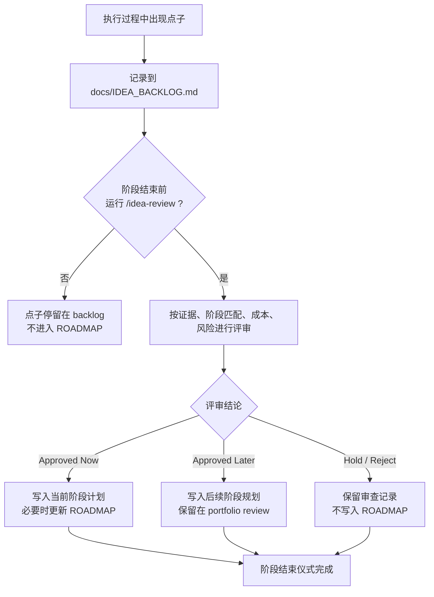
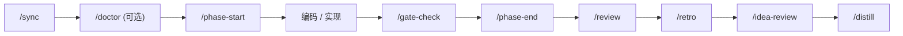
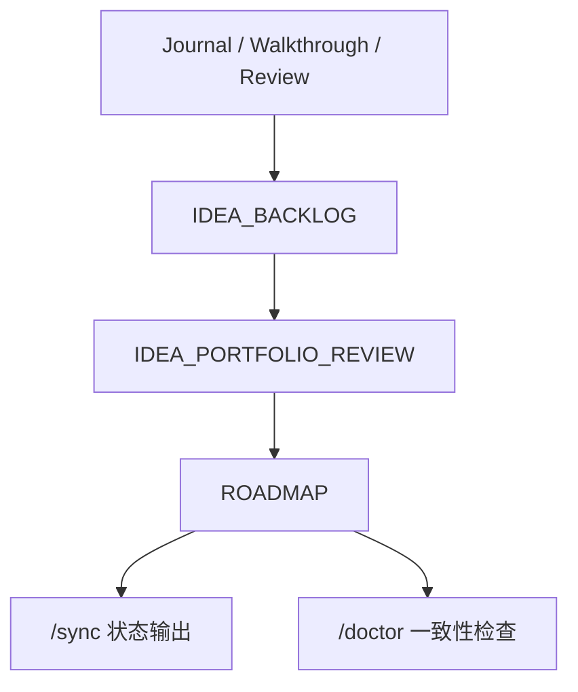

# Workflow Design: Idea Governance and `/doctor`

**Date**: 2026-03-08  
**Status**: Active design  
**Purpose**: 将“执行过程中出现的点子”纳入可控演进闭环，并通过 `/doctor` 提供工作流自检能力

---

## 1. 背景

NexusRhythm 已经具备阶段状态机、文档沉淀、hooks、commands 和 review 的基本工作流，但“执行中冒出的好点子”此前只有收集，没有稳定准入机制。直接把点子写进 `ROADMAP.md` 会污染承诺层；完全不进流程，又会让高价值想法在阶段结束后丢失。

同时，脚手架工程最怕“看起来装好了，但关键接线其实没生效”。因此需要一个标准化的 `/doctor` 自检入口，帮助快速判断当前仓库是否健康。

这份设计文档定义两件事：

1. 点子从产生到进入 ROADMAP 的准入闭环
2. `/doctor` 如何验证这套闭环和项目脚手架是否健康

---

## 2. 设计目标

- 原始点子有地方落，不丢失
- 未审查点子不得直接污染 `ROADMAP.md`
- 通过点子评审后，才能进入计划、阶段目标或 ADR
- `/doctor` 可以快速判断当前工作流是否处于可信状态
- 阶段结束时，点子、复盘、评审和计划同步形成闭环

---

## 3. 设计原则

### 3.1 收集区与承诺区分离

- `docs/IDEA_BACKLOG.md` 是原始收集区
- `docs/IDEA_PORTFOLIO_REVIEW.md` 是审查结论区
- `ROADMAP.md` 是承诺区

### 3.2 先评审，后准入

只有 `Approved Now` 或 `Approved Later` 的点子，才允许进入：

- 当前阶段计划
- `ROADMAP.md`
- ADR

### 3.3 `/doctor` 只诊断，不隐式修复

自检命令的职责是发现问题并分级，不替用户悄悄改状态或改文档。

---

## 4. 总体流程图

---

## 5. 与阶段工作流的集成

说明：

- `/doctor` 是会话早期的健康检查，不是阶段状态的一部分
- `/idea-review` 是阶段结束时的“规划准入门”
- `/distill` 处理教训，不处理规划准入

---

## 6. `/doctor` 的职责边界

`/doctor` 负责回答一个问题：

> 当前这个仓库的 NexusRhythm 接线和阶段文档，是否可信？

### 6.1 检查对象

- 核心文件是否存在
- `.claude/settings.json` 是否可解析
- hooks 脚本是否语法正确、可执行
- 核心命令是否存在：`/sync`、`/phase-start`、`/gate-check`、`/phase-end`、`/review`、`/idea-review`、`/doctor`
- 已完成阶段是否具备 Walkthrough 和 Code Review
- 点子治理闭环文件是否齐全

### 6.2 输出分级

- `GREEN`：结构完整，工作流可信
- `YELLOW`：存在非阻塞缺口，应尽快修
- `RED`：存在阻塞缺口，当前工作流不可信

### 6.3 非职责

`/doctor` 不做：

- 自动修改 `ROADMAP.md`
- 自动补文档
- 自动修 hook 或命令

它只报告，不隐式修复。

---

## 7. 信息流设计

含义：

- 执行中产生的信息先进入 backlog
- 审查结论进入 portfolio review
- 只有通过准入的事项才反映到 ROADMAP
- `/sync` 负责读状态
- `/doctor` 负责查状态和接线是否一致

---

## 8. 准入规则

点子只有在满足以下条件时才可进入 `ROADMAP.md`：

1. 已写入 `docs/IDEA_BACKLOG.md`
2. 已经过 `/idea-review`
3. 审查结论为 `Approved Now` 或 `Approved Later`
4. 已明确是进入当前阶段还是未来阶段
5. 如果涉及结构性演进，补 ADR

---

## 9. 文档落点

- 原始点子：`docs/IDEA_BACKLOG.md`
- 审查结论：`docs/IDEA_PORTFOLIO_REVIEW.md`
- 阶段计划：如 `docs/PHASE_0_EXECUTION_PLAN.md`
- 正式承诺：`ROADMAP.md`
- 结构性决策：`docs/decisions/*.md`
- 健康检查入口：`.claude/commands/doctor.md`

---

## 10. 后续演进建议

- 为 `/doctor` 增加一个可复用脚本层，降低重复 prompt 解析
- 让 `/doctor` 支持 `quick` / `full` 两种模式
- 在 Phase 1 中为 `/doctor` 和 hooks 增加 smoke tests
- 后续可把 `/idea-review` 与 `/doctor` 的部分检查沉淀到 skill
