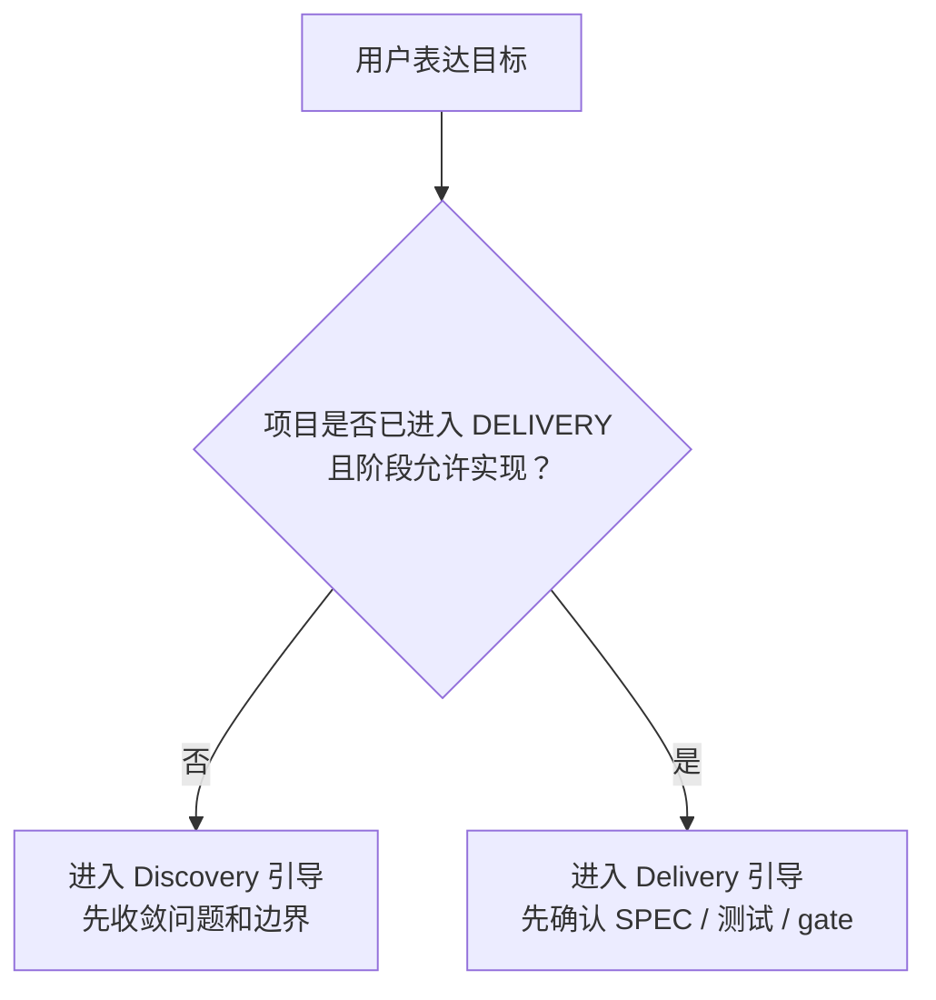

# Product Design: New User Zero-Cognitive-Load Strategy

**Date**: 2026-03-08  
**Status**: Active design  
**Purpose**: 定义 NexusRhythm 如何在保留严谨节奏的同时，让普通用户主要通过“表达意图”而不是“学习命令和术语”来使用系统

---

## 1. 背景

NexusRhythm 当前已经有明确的状态机、命令、hooks、agents、memory 和文档产物体系。它对重度 Claude Code 使用者已经有明显价值，但对新手而言，仍存在一个高摩擦事实：

- Claude Code 自身的 hooks、skills、subagents、上下文管理已经足够让人发懵
- NexusRhythm 又额外引入了 `Project_Stage`、`Phase_Status`、`Active_Mode`、`Pending_Debt`、`/idea-capture`、`/phase-start` 等节奏概念
- 如果这些概念过早直接暴露给普通用户，会把“更可靠的 AI 协作”误感知成“更复杂的 AI 工具”

因此，这个项目需要一条更明确的产品主线：

> 规则主要是给 AI 看的，而不是要求普通用户先学会规则，才能开始做项目。

这不意味着规则可以不对人可见，而是意味着：

- 普通用户默认看到的是“当前步骤、原因、下一步”
- AI 在底层负责把用户意图映射到 Discovery / Delivery、命令、文档和门禁
- 熟练用户仍可以显式调度命令，获取全部能力

---

## 2. 目标与非目标

### 2.1 目标

- 让第一次接触 NexusRhythm 的用户可以只用自然语言表达目标，然后被 AI 带入正确节奏
- 降低用户第一次会话中接触到的术语和命令数量
- 在不削弱核心纪律的前提下，让节奏“更像被 AI 编排”，而不是“像一套要背下来的流程图”
- 保留 power user 的高可控性，不把产品做成只有傻瓜模式

### 2.2 非目标

- 不隐藏所有状态与规则，完全黑箱会损伤信任和可调试性
- 不为了新手体验删除 `ROADMAP.md`、`SPEC`、`/gate-check` 等核心约束
- 不在当前阶段同时分叉出一套“新手版流程”和“专家版流程”
- 不把“零感知”误做成“零约束”

---

## 3. 核心判断

### 3.1 应该隐藏的，不是纪律，而是术语面

真正让新手放弃的，通常不是“先想清楚再写代码”这种纪律，而是：

- 他不知道 `Discovery` 和 `Delivery` 这些词是什么意思
- 他不知道为什么此时该 `/idea-capture` 而不是 `/phase-start`
- 他不知道 hooks、agents、skills 各自负责什么

因此，产品设计应该优先隐藏：

- 命令名
- 能力模型名
- 目录结构细节
- 大部分状态机术语

但不应该隐藏：

- 当前正在做什么
- 为什么现在不能直接写代码
- 下一步是什么

### 3.2 “完全不给人看”不是正确方向

如果系统只让 AI 看得懂，而人类完全不知道发生了什么，会出现三个问题：

1. 一旦 AI 判断错了，用户无法校正
2. 用户会把“严格流程”感知成“莫名其妙地被阻止”
3. 维护者无法快速判断当前卡点在规则、命令还是项目本身

所以，正确的目标不是“完全零感知”，而是：

> 对规则本体低感知，对当前步骤和原因高可见。

---

## 4. 用户分层

| 用户类型 | 当前状态 | 真正需要什么 |
|----------|----------|--------------|
| AI 编程新手 | 只会说“帮我实现 XXX” | AI 先收敛问题，再逐步带路，而不是马上开始写 |
| 普通项目 owner | 知道目标，但不懂 Claude Code 的高级能力 | 一套稳定、低术语、低负担的默认协作体验 |
| Claude Code 熟练用户 | 已习惯命令、agent、worktree、记忆 | 不要为了新手体验砍掉精细控制能力 |

这意味着 NexusRhythm 不应该在产品层分裂为两套系统，而应采用：

- 默认体验：意图输入优先，AI 隐式编排
- 深度体验：命令、状态机、agent 显式暴露

---

## 5. 体验策略

### 5.1 交互原则：Intent First, Commands Second

对新手来说，最自然的输入不应该是：

```text
/idea-capture
/mvp-shape
/phase-start
```

而应该是：

```text
我想做一个 XXX。
请按这套节奏先判断现在该澄清问题，还是该进入实现。
```

系统内部再由 AI 做这些判断：

- 当前是 `Project_Stage` 的哪个区间
- 该进入哪个底层命令或模板
- 是否需要阻止直接实现
- 是否需要提醒技术债或门禁

中期实现路径建议：

- 前期可先提供一个统一的“开始协作”入口，降低第一跳摩擦
- 后续再逐步演进到主要依赖自然语言输入即可完成分流
- 如果后续引入 skill，应优先承接“意图识别 + 路由 + 当前步骤说明”这层能力，而不是把现有命令简单平移一遍

### 5.2 状态呈现原则：只暴露最小控制面

新手默认不需要看到完整状态机解释，但需要固定看到三件事：

1. **现在在哪一步**
2. **为什么是这一步**
3. **下一步是什么**

推荐把任何关键阶段回复都压缩为类似结构：

```text
当前步骤：收敛需求
原因：现在目标和范围还没讲清楚，直接写代码很容易越做越偏
下一步：我先帮你把目标用户、核心问题和最小版本整理清楚，再开始实现
```

### 5.3 节奏保护原则：允许自然语言，拒绝无界放飞

当用户直接说“给我实现 XXX 功能”时，AI 不应机械照做，而应先做一次意图分流：



这一步是“零感知使用策略”的核心，不是附加体验。

---

## 6. 系统落地策略

### 6.1 第一层：AI 默认话术收敛

在 `CLAUDE.md`、commands、未来的 skills 中统一要求：

- 优先解析用户意图，而不是要求用户先给命令
- 关键回复必须解释“当前步骤 / 原因 / 下一步”
- 当用户想直接跳到实现时，先检查 `Project_Stage` 与 `Phase_Status`

### 6.2 第二层：命令降噪，不命令消失

命令依然存在，但默认由 AI 在内部选择和引导，普通用户不必自己记住它们。

对新手真正应该暴露的入口，尽量只保留三个：

- `我想做什么`
- `我们现在卡在哪`
- `继续下一步`

而不是一次性暴露所有 slash commands。

### 6.3 第三层：保留专家逃生舱

熟练用户需要：

- 显式运行 `/doctor`
- 显式运行 `/gate-check`
- 手动读写 `ROADMAP.md`
- 精准指定某个阶段或某个 agent

因此，零感知策略不应替代命令层，而应覆盖默认体验层。

---

## 7. 成功指标

如果这条策略落地成功，应出现以下现象：

### 7.1 新手体验指标

- 新用户第一次使用时，前 20 分钟内无需主动学习超过 3 个术语
- 用户只用一句自然语言目标，也能被 AI 正确带入 Discovery 或 Delivery
- 用户第一次会话中，不需要自己主动想起 `/idea-capture`、`/phase-start` 等命令名

### 7.2 节奏可靠性指标

- 当项目尚未准备好实现时，AI 拒绝直接写代码的概率显著上升
- 当项目已经在 Delivery 中，AI 更少错误回退到 Discovery 命令
- 关键步骤回复中，“当前步骤 / 原因 / 下一步”结构稳定出现

### 7.3 专家效率指标

- 熟练用户仍可直接使用显式命令，不被新手策略拖慢
- 文档、命令、scripts 的一致性不下降
- 新手优化不引入额外状态源

---

## 8. 风险与取舍

### 8.1 过度隐藏的风险

如果过度追求“零感知”，系统会变成一个黑箱：

- 用户不知道为什么被阻止
- 维护者不知道应该修文档、修脚本还是修引导
- 一旦 AI 误判，用户难以纠偏

### 8.2 过度显式的风险

如果继续让新手一开始就面对全部概念：

- 他会把 NexusRhythm 理解成“又一套复杂工具”
- 还没享受到节奏收益，就先被认知负担劝退

### 8.3 正确的平衡点

应当追求：

- **规则严**
- **入口轻**
- **解释短**
- **状态可查**

---

## 9. 与现有路线的关系

这条策略不应打断当前 Phase 1 的可靠性加固，而应作为后续阶段的产品北极星：

### Phase 1

- 保持兼容性与可靠性优先
- 继续把 hooks、`/doctor`、关键门禁做扎实

### Phase 2

- 开始把“意图输入 -> AI 路由节奏”做成更稳定的默认行为
- 把关键流程从“要求用户知道命令”推进到“AI 根据状态自动引导”

### Phase 3

- 交付面向新手的默认体验
- 用 demo repo、示例会话和安装后首轮引导证明这条路径真的有效

---

## 10. 建议写入产品路线的工作流

### Workstream A: 意图优先引导

- 为新手场景定义标准响应结构：当前步骤 / 原因 / 下一步
- 在 `CLAUDE.md` 和后续 skills 中统一这套引导话术
- 识别“直接要求实现”的输入，并优先检查是否应先走 Discovery

### Workstream B: 默认入口收缩

- 重新定义对新手显式暴露的最小入口
- 将 slash commands 视为底层能力，而不是第一层产品界面
- 补一份“只说目标也能开始”的示例会话

### Workstream C: 会话可解释性

- 让 AI 在每个关键转折点简短解释为什么切阶段
- 固化错误拦截提示，避免“机械拒绝”
- 让 `/sync` 输出更像“当前导航卡”，而不只是状态字段罗列

### Workstream D: 保留熟练用户能力

- 显式命令继续保留
- `ROADMAP.md` 继续作为真相源
- `doctor / gate-check / review` 继续可直接调用

---

## 11. 当前决策与待验证项

### 已决定

1. 前期先提供更统一的“开始协作”入口，后续目标再演进到主要依赖自然语言即可启动
2. `CLAUDE.md` 需要区分“默认协作模式”和“专家调度模式”，且默认进入前者
3. `/sync` 后续应进一步压缩为更强的“下一步导航卡”
4. demo repo 中值得内置一个“新手第一会话”脚本化示例

### 仍待验证

1. 统一入口最终应表现为一个显式命令、skill，还是完全隐式的自然语言路由
2. skill 在这条策略里应承接多少编排职责，才不会和现有命令层重复
3. 默认协作模式下，哪些术语仍然必须偶尔暴露，才能保持可解释性

---

## 12. 结论

NexusRhythm 的下一阶段，不应只是把更多命令、更多 docs、更多 rules 叠上去，而应让整套纪律越来越像“AI 的默认能力”，而不是“用户必须先学会的一套方法论”。

换句话说：

> 这套系统的理想形态，不是让人先学会 NexusRhythm 再开始做项目，而是让 AI 先学会 NexusRhythm，再带着人做项目。
