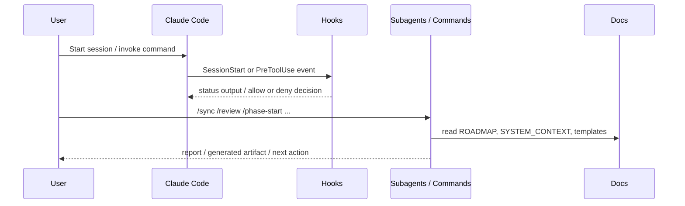

# SPEC: Claude Code 兼容性加固

**Phase**: Phase 1 — Claude Code 兼容性加固
**Status**: Draft
**Author**: Codex
**Date**: 2026-03-08

---

## 1. 背景与目标

NexusRhythm 当前已经形成可用的文档、commands、subagents 和 hooks 结构，但部分实现与 2026-03-08 官方 Claude Code 文档存在偏差，尤其是 hooks 的 matcher、阻断返回方式、命令能力模型和缺失的 `/review` 入口。这一阶段的目标是把现有骨架从“理念正确”推进到“与官方规范兼容且更可靠”。

**范围**（In Scope）：
- 审计并修复 hooks、commands、subagents 与官方文档的关键偏差
- 增加缺失但文档已承诺的 `/review` 命令入口
- 把高风险 inline hook 逻辑外提为脚本，便于维护和复用
- 产出合规审计、项目评估和执行计划文档

**非范围**（Out of Scope）：
- 全量迁移到 `.claude/skills/`
- 建立完整 CI、端到端测试或插件市场发布流程
- 设计业务代码级别的测试框架

---

## 2. 接口契约（Interface Contract）

```text
Inputs:
- ROADMAP.md phase metadata
- .claude/settings.json hook routes
- .claude/commands/*.md workflow prompts
- .claude/agents/*.md subagent definitions
- Official Claude Code docs and changelog

Outputs:
- Updated hook scripts and settings
- Updated/manual review command surface
- Compliance audit document
- Project assessment report
- Phase execution plan

Invariant rules:
- Existing /command entrypoints remain user-invocable
- Hook behavior must follow current official matcher and blocking semantics
- Changes stay within Phase 0/Phase 1 planning scope and do not assume a business runtime exists
```

---

## 3. 数据流（Data Flow）



---

## 4. 边界条件与异常路径

| # | 场景 | 输入 | 期望行为 | 对应测试 |
|---|------|------|----------|----------|
| 1 | 正常启动 | 存在合法 `ROADMAP.md` | `SessionStart` 输出结构化状态 | `test_session_start_status_output` |
| 2 | 无 ROADMAP | 缺少 `ROADMAP.md` | hook 安静退出，不阻断会话 | `test_session_start_without_roadmap` |
| 3 | 债务阻塞提交 | `Pending_Debt: true` 且 Bash 命令包含 `git commit` / `git push` | `PreToolUse` 拒绝执行并返回阻断原因 | `test_pre_tool_use_blocks_git_commit_with_debt` |
| 4 | 非 Git Bash 命令 | `Pending_Debt: true` 但执行 `npm test` | hook 放行 | `test_pre_tool_use_allows_safe_bash` |
| 5 | 命令手动触发 | 用户调用 `/review` | reviewer 工作流可被显式调用 | `test_review_command_is_available` |
| 6 | 官方规范漂移 | 文档字段或语义发生变化 | 合规审计更新，Phase 计划重新评估 | `test_compliance_audit_has_current_sources` |

---

## 5. 兼容性影响评估（Impact Analysis）

**破坏性变更**：低
- 主要变更是修正内部脚手架行为，不影响用户已有文档结构
- `/review` 为新增入口，不破坏原有 `/phase-end` 流程

**性能影响**：
- 预估额外延迟：< 20 ms / hook
- 预估额外内存：可忽略
- 是否影响热路径：否

**依赖变更**：
- 新增依赖：无
- 移除依赖：无

---

## 6. 测试用例清单（Test Mapping）

> 以下测试用例应在编写实现前全部写好并确认失败

- [ ] `test_session_start_status_output` — 会话启动状态输出
- [ ] `test_session_start_without_roadmap` — 无 ROADMAP 的容错
- [ ] `test_pre_tool_use_blocks_git_commit_with_debt` — 债务状态下阻断提交
- [ ] `test_pre_tool_use_allows_safe_bash` — 非提交 Bash 命令放行
- [ ] `test_review_command_is_available` — `/review` 命令可见且可执行
- [ ] `test_compliance_audit_has_current_sources` — 官方对照源存在且有日期

---

## 7. 评审记录

| 日期 | 评审人 | 意见 | 状态 |
|------|--------|------|------|
| 2026-03-08 | Codex | 初稿已形成，可进入红灯测试规划 | Pending |
