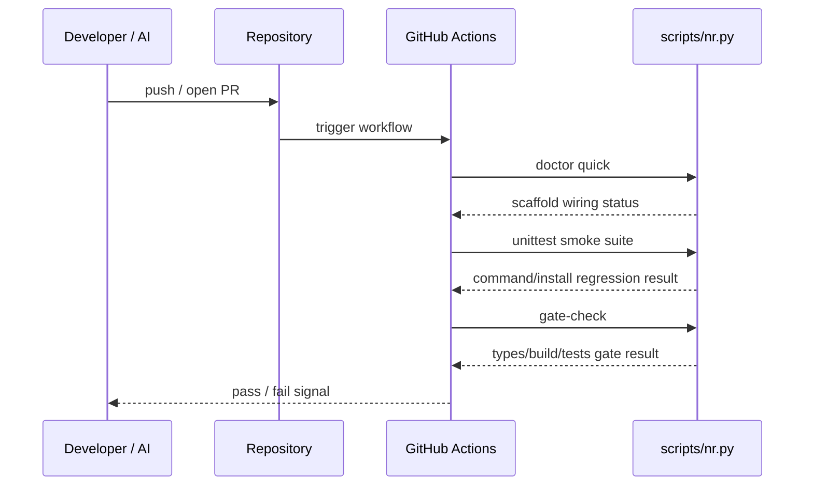

# SPEC: CI-backed hard gates

**Phase**: Phase 2 — 自动化与硬门禁
**Status**: Draft
**Author**: Codex
**Date**: 2026-03-09

---

## 1. 背景与目标

Phase 1 已经把 `/sync`、`/doctor`、`/review` 和 smoke tests 打磨到“本地可验证”的状态，但当前最大的结构性缺口仍然存在：仓库缺少一个默认启用的 CI 执行层，`install.sh` 也不会把自动化门禁传播到新项目。这意味着流程虽然看起来完整，但关键约束依旧依赖使用者自觉运行，无法形成真正的硬门禁。

本轮只推进 Phase 2 的第一刀：把现有 `scripts/nr.py` 中已经沉淀下来的检查能力接到 GitHub Actions，并确保安装后的项目也具备同样的最小自动化基线。这样可以先建立“默认可验证”的骨架，再决定下一步是否继续扩 skill 或收敛 AI 引导。

**Upstream Idea Brief**：N/A
**Upstream MVP Canvas**：N/A
**Mapped Success Metric**：核心命令有脚本和 smoke tests，并从“本地约定”升级到“仓库内建自动化”
**Why This Phase Now**：如果没有默认 CI，Phase 1 的门禁仍然可能因人工遗漏而失效；先补硬门禁比继续扩展新入口更能降低真实风险

**范围**（In Scope）：
- 在仓库内新增 GitHub Actions workflow，显式运行 `python3 scripts/nr.py doctor quick`
- 在同一 workflow 中运行 `python3 -m unittest tests.test_nexusrhythm_smoke`
- 在同一 workflow 中运行 `python3 scripts/nr.py gate-check`
- 更新 `install.sh`，把 `.github/workflows` 一并复制到目标项目
- 扩展 `/doctor` 的检查项，使其能够识别关键 CI workflow 是否存在
- 为上述行为补充 smoke tests

**非范围**（Out of Scope）：
- 同时支持 GitLab CI、Buildkite 或其他 CI 提供方
- 在本轮推进第二个复杂 workflow 的 skill 迁移
- 重写 `gate-check` 的栈探测策略
- 引入远程发布、版本打包或 marketplace 分发流程

---

## 2. 接口契约（Interface Contract）

```text
Inputs:
- scripts/nr.py doctor quick
- scripts/nr.py gate-check
- tests/test_nexusrhythm_smoke.py
- install.sh
- .github/workflows/*.yml

Outputs:
- Repository-level CI workflow file
- Installed projects receive the same workflow baseline
- doctor quick reports missing CI wiring as scaffold health drift

Invariant rules:
- CI must reuse existing nr.py entrypoints instead of duplicating shell logic
- CI baseline must be installable into downstream projects by install.sh
- doctor quick may validate workflow presence, but must not require network access
- Existing gate-check behavior for the current scaffold must remain green
```

---

## 3. 数据流（Data Flow）



---

## 4. 边界条件与异常路径

| # | 场景 | 输入 | 期望行为 | 对应测试 |
|---|------|------|----------|----------|
| 1 | 仓库自身具备 CI workflow | 默认仓库布局 | workflow 文件存在且复用 `nr.py` 入口 | `test_ci_workflow_runs_nexusrhythm_entrypoints` |
| 2 | 安装到新项目 | 空目标目录运行 `install.sh` | `.github/workflows/ci.yml` 被复制到目标项目 | `test_install_copies_ci_workflow` |
| 3 | 下游项目缺少 CI workflow | 删除 `.github/workflows/ci.yml` 后运行 `doctor quick` | `doctor` 报告缺失自动化接线并返回失败 | `test_doctor_fails_when_ci_workflow_is_missing` |
| 4 | CI 文件存在但绕过脚手架入口 | workflow 中缺少 `scripts/nr.py` 命令 | smoke test 失败，阻止引入第二套门禁逻辑 | `test_ci_workflow_runs_nexusrhythm_entrypoints` |
| 5 | 现有脚手架门禁回归 | 默认仓库执行 `gate-check` | 仍然通过，不因新增 CI 接线退化 | `test_gate_check_passes_on_installed_scaffold` |

---

## 5. 兼容性影响评估（Impact Analysis）

**破坏性变更**：低
- 新增 `.github/workflows/ci.yml` 只会增强默认检查面，不改变现有命令入口
- `install.sh` 新增复制目录属于向前兼容扩展
- `doctor quick` 新增 CI 检查会让缺失 workflow 的项目更早失败，这是期望的硬化行为

**性能影响**：
- 预估额外延迟：本地 `doctor quick` 增加 < 10 ms 文件存在性检查
- 预估额外内存：可忽略
- 是否影响热路径：否

**依赖变更**：
- 新增依赖：无
- 移除依赖：无

---

## 6. 测试用例清单（Test Mapping）

> 以下测试用例应在编写实现前全部写好并确认失败

- [ ] `test_ci_workflow_runs_nexusrhythm_entrypoints` — CI workflow 使用脚手架标准入口
- [ ] `test_install_copies_ci_workflow` — 安装链路复制 workflow
- [ ] `test_doctor_fails_when_ci_workflow_is_missing` — 缺失 CI workflow 时 doctor 失败
- [ ] `test_gate_check_passes_on_installed_scaffold` — 新增自动化后基础门禁仍可通过

---

## 7. 评审记录

| 日期 | 评审人 | 意见 | 状态 |
|------|--------|------|------|
| 2026-03-09 | Codex | Phase 2 范围已收敛为 CI-backed hard gates，可进入红灯测试 | Pending |
