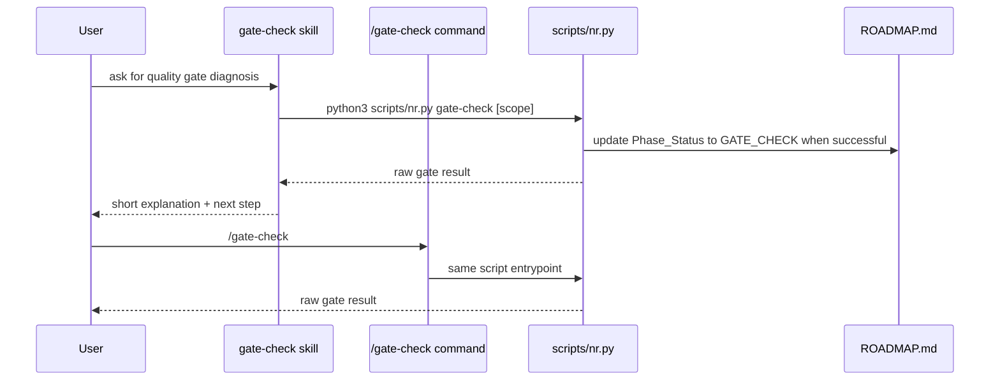

# SPEC: gate-check skill boundary hardening

**Phase**: Phase 2 — 自动化与硬门禁（Slice B）
**Status**: Draft
**Author**: Codex
**Date**: 2026-03-09

---

## 1. 背景与目标

Phase 2 的第一刀已经把 `doctor`、smoke tests 和 `gate-check` 接入默认 CI，解决了“门禁没人跑”的硬约束问题。但当前 command 与 skill 的演进边界仍然不够稳定：只有 `doctor` 完成了 skill 试点，关键交付 workflow 仍主要停留在 `.claude/commands/`，这会让后续 skills 演进继续依赖临时判断，而不是明确规则。

本轮不做大规模迁移，只推进第二个代表性 workflow：`gate-check`。它已经有稳定脚本入口、边界清晰、失败语义明确，适合成为“command 保持兼容、skill 提供更好解释层”的第二个试点。这样可以在不引入复杂 review 编排的前提下，先验证 command-first / skill-first 的稳定共存方式。

**Upstream Idea Brief**：N/A
**Upstream MVP Canvas**：N/A
**Mapped Success Metric**：核心命令不仅有脚本和 smoke tests，还具备更稳定的 skills 入口体系
**Why This Phase Now**：CI 基线已经建立，下一步最该补的是 workflow 入口边界；如果继续只靠 commands 堆命令，skills 演进仍然会停留在零散试点

**范围**（In Scope）：
- 新增 `.claude/skills/gate-check/SKILL.md`
- skill 复用既有脚本入口 `python3 scripts/nr.py gate-check ${ARGUMENTS:-all}`
- skill 输出遵循“当前步骤 / 原因 / 下一步”的短解释结构
- 保留 `.claude/commands/gate-check.md` 作为兼容入口
- 为 gate-check skill 增加 smoke tests，覆盖安装结果与关键能力点

**非范围**（Out of Scope）：
- 一次性把 `/phase-end`、`/review` 等复杂流程全部迁到 skills
- 重写 `scripts/nr.py gate-check` 的栈探测逻辑
- 为 reviewer 增加预加载 skill 或多 reviewer 路由
- 把 commands 目录整体降级或删除

---

## 2. 接口契约（Interface Contract）

```text
Inputs:
- .claude/commands/gate-check.md
- .claude/skills/gate-check/SKILL.md
- scripts/nr.py gate-check
- install.sh
- tests/test_nexusrhythm_smoke.py

Outputs:
- A stable gate-check skill entrypoint
- Existing /gate-check command remains valid
- Installed projects receive the gate-check skill
- Smoke tests lock the command/skill coexistence contract

Invariant rules:
- The skill must call the existing nr.py gate-check entrypoint
- The command remains available as a compatibility surface
- The skill should add interpretation value, not duplicate the command body verbatim
- No new workflow may bypass the existing gate-check status transition semantics
```

---

## 3. 数据流（Data Flow）



---

## 4. 边界条件与异常路径

| # | 场景 | 输入 | 期望行为 | 对应测试 |
|---|------|------|----------|----------|
| 1 | 安装后的项目具备 gate-check skill | 默认安装流程 | `.claude/skills/gate-check/SKILL.md` 存在 | `test_gate_check_skill_is_available` |
| 2 | skill 入口调用标准脚本 | 读取 skill 内容 | 包含 `scripts/nr.py gate-check` 调用 | `test_gate_check_skill_is_available` |
| 3 | skill 输出不是命令文案机械复制 | 读取 skill 内容 | 包含解释层结构而非只剩 shell 命令 | `test_gate_check_skill_is_available` |
| 4 | 兼容命令入口仍然存在 | 默认安装流程 | `.claude/commands/gate-check.md` 继续存在 | `test_install_wires_scripts_commands_templates_and_memory` |
| 5 | 现有 gate 语义不回归 | 运行 `gate-check` | 默认脚手架仍然通过，并保持状态更新语义 | `test_gate_check_passes_on_installed_scaffold` |

---

## 5. 兼容性影响评估（Impact Analysis）

**破坏性变更**：低
- 新增 skill 不移除现有 command，不会破坏已有入口
- skill 只包装现有脚本，不引入第二套门禁逻辑

**性能影响**：
- 预估额外延迟：仅在显式调用 skill 时增加极轻量解释层，无可感知开销
- 预估额外内存：可忽略
- 是否影响热路径：否

**依赖变更**：
- 新增依赖：无
- 移除依赖：无

---

## 6. 测试用例清单（Test Mapping）

> 以下测试用例应在编写实现前全部写好并确认失败

- [ ] `test_gate_check_skill_is_available` — gate-check skill 存在且包含关键结构
- [ ] `test_install_wires_scripts_commands_templates_and_memory` — 安装结果含 gate-check skill
- [ ] `test_gate_check_passes_on_installed_scaffold` — skill 引入后原有 gate 语义不回归

---

## 7. 评审记录

| 日期 | 评审人 | 意见 | 状态 |
|------|--------|------|------|
| 2026-03-09 | Codex | 保持 Phase 2 编号不变，以 Slice B 方式继续推进下一个 skill 试点 | Pending |
