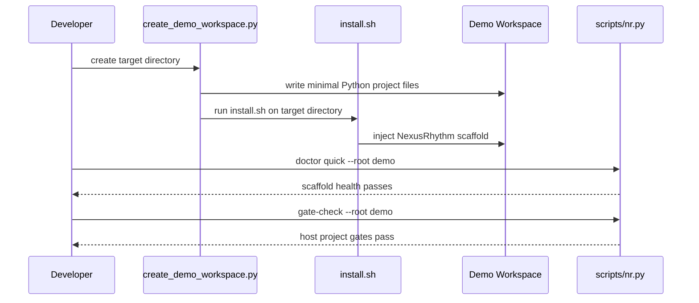

# SPEC: v0.2 blank-project bootstrap validation

**Phase**: Phase 3 — v0.2 空白项目 bootstrap 验证
**Status**: Implemented
**Author**: Codex
**Date**: 2026-03-09

---

## 1. 背景与目标

Phase 2 已经证明 NexusRhythm 的脚本、CI 和 skills 基线在仓库自身内部是可靠的，但 `v0.2` 仍缺少一条关键验收：如何证明空白项目安装后真的能跑通。这份 SPEC 对应的不是更大范围的“产品化主线”，而是 `v0.2` 的 blank-project bootstrap validation。

本轮新增一个 demo workspace bootstrap 脚本。它负责创建最小 Python 示例项目、注入 NexusRhythm 脚手架，并让生成后的工程默认通过 `doctor quick` 与 `gate-check`。这比在仓库里手工维护一整份静态 demo 更稳，也更接近真实安装路径下的收口验收。

**Upstream Idea Brief**：N/A
**Upstream MVP Canvas**：N/A
**Mapped Success Metric**：10 分钟内完成脚手架注入与会话启动，并用空白项目样本证明安装后链路可跑通
**Why This Phase Now**：如果没有这道 blank-project 验收，`v0.2` 只能证明“仓库自身可用”，还不能证明“新项目安装后可用”

**范围**（In Scope）：
- 新增脚本在目标目录生成最小 Python demo workspace
- demo workspace 至少包含宿主代码、测试、`pyproject.toml` 和 README
- 脚本自动调用现有 `install.sh` 将 NexusRhythm 注入 demo workspace
- 新增 smoke tests 验证生成后的 demo workspace 可通过 `doctor quick`
- 新增 smoke tests 验证生成后的 demo workspace 可通过 `gate-check`

**非范围**（Out of Scope）：
- 发布独立 demo 仓库到远端平台
- 同时支持多语言 demo（Node / Go / Rust 等）
- 设计完整的新手引导 UI 或 CLI
- 引入产品级版本管理、升级器或多平台分发

---

## 2. 接口契约（Interface Contract）

```text
Inputs:
- scripts/create_demo_workspace.py
- install.sh
- scripts/nr.py doctor quick
- scripts/nr.py gate-check
- tests/test_nexusrhythm_smoke.py

Outputs:
- A generated demo workspace in a target directory
- Demo workspace includes minimal host project files
- Demo workspace receives NexusRhythm scaffold via install.sh
- Demo workspace passes doctor quick and gate-check

Invariant rules:
- The demo generator must reuse install.sh instead of reimplementing scaffold copying
- The generated demo must be minimal and ASCII-friendly
- The generated demo must validate both scaffold health and host-project quality gates
- The generator must work without network access
```

---

## 3. 数据流（Data Flow）



---

## 4. 边界条件与异常路径

| # | 场景 | 输入 | 期望行为 | 对应测试 |
|---|------|------|----------|----------|
| 1 | 生成新的 demo workspace | 空目录路径 | 生成最小 Python 项目并注入脚手架 | `test_create_demo_workspace_bootstraps_project` |
| 2 | demo workspace 包含宿主测试 | 读取生成目录 | 至少存在宿主源码和 `tests/test_*.py` | `test_create_demo_workspace_bootstraps_project` |
| 3 | demo workspace 通过 doctor | 运行 `doctor quick` | 返回绿色状态 | `test_demo_workspace_passes_doctor_and_gate_check` |
| 4 | demo workspace 通过 gate-check | 运行 `gate-check --no-update` | types/build/tests 全部通过 | `test_demo_workspace_passes_doctor_and_gate_check` |
| 5 | 目标目录已存在内容 | 非空目录 | 脚本拒绝覆盖并返回失败 | `test_create_demo_workspace_refuses_nonempty_directory` |

---

## 5. 兼容性影响评估（Impact Analysis）

**破坏性变更**：低
- 新增的是可选脚本和测试，不改变现有安装链路
- demo workspace 复用 `install.sh`，不会生成第二套脚手架复制逻辑

**性能影响**：
- 预估额外延迟：仅在显式生成 demo workspace 时执行文件写入和安装
- 预估额外内存：可忽略
- 是否影响热路径：否

**依赖变更**：
- 新增依赖：无
- 移除依赖：无

---

## 6. 测试用例清单（Test Mapping）

> 以下测试用例应在编写实现前全部写好并确认失败

- [x] `test_create_demo_workspace_bootstraps_project` — 生成最小 demo workspace 并注入脚手架
- [x] `test_create_demo_workspace_refuses_nonempty_directory` — 拒绝覆盖非空目录
- [x] `test_demo_workspace_passes_doctor_and_gate_check` — 生成后的 demo workspace 通过核心验证

---

## 7. 评审记录

| 日期 | 评审人 | 意见 | 状态 |
|------|--------|------|------|
| 2026-03-09 | Codex | 作为 `v0.2` 空白项目 bootstrap 验收实现完成 | Approved |
