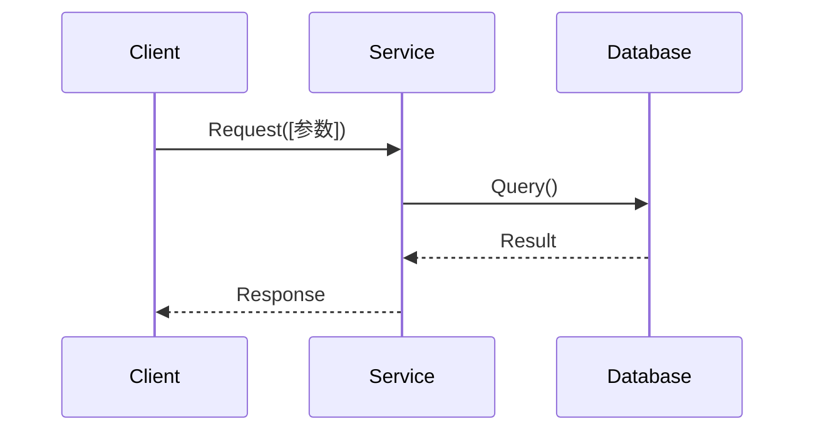

# SPEC: [功能名称]

**Phase**: Phase N — [阶段名称]
**Status**: `Draft` → `Review` → `Approved` → `Implemented`
**Author**: [作者]
**Date**: YYYY-MM-DD

---

## 1. 背景与目标

[为什么需要这个功能？解决什么问题？]

**范围**（In Scope）：
- [包含项 1]

**非范围**（Out of Scope）：
- [排除项 1]

---

## 2. 接口契约（Interface Contract）

```python
# 示例：函数/类/API 端点签名
def function_name(param: Type) -> ReturnType:
    """
    [描述]
    
    Args:
        param: [说明]
    
    Returns:
        [说明]
    
    Raises:
        ValueError: [何时抛出]
    """
    ...
```

---

## 3. 数据流（Data Flow）



---

## 4. 边界条件与异常路径

| # | 场景 | 输入 | 期望行为 | 对应测试 |
|---|------|------|----------|----------|
| 1 | 正常路径 | [合法输入] | 返回正确结果 | `test_normal_flow` |
| 2 | 空输入 | `None` / `""` | 抛出 `ValueError` | `test_empty_input` |
| 3 | 越界值 | [极端值] | [预期处理] | `test_boundary_value` |
| 4 | 并发场景 | [并发请求] | [预期处理] | `test_concurrent_access` |

---

## 5. 兼容性影响评估（Impact Analysis）

**破坏性变更**：无 / 有
- [如果有，描述影响范围和迁移路径]

**性能影响**：
- 预估额外延迟：< ___ ms
- 预估额外内存：< ___ MB
- 是否影响热路径：是 / 否

**依赖变更**：
- 新增依赖：[无 / 包名@版本]
- 移除依赖：[无 / 包名]

---

## 6. 测试用例清单（Test Mapping）

> 以下测试用例应在编写实现前全部写好并确认**失败**

- [ ] `test_[功能]_normal_flow` — 正常路径
- [ ] `test_[功能]_empty_input` — 空输入处理
- [ ] `test_[功能]_invalid_type` — 类型错误
- [ ] `test_[功能]_boundary_values` — 边界值
- [ ] `test_[功能]_error_handling` — 异常处理
- [ ] `test_[功能]_performance` — 性能基准（如适用）

---

## 7. 评审记录

| 日期 | 评审人 | 意见 | 状态 |
|------|--------|------|------|
| [日期] | [姓名] | [LGTM / 有修改意见] | [Approved/Pending] |
